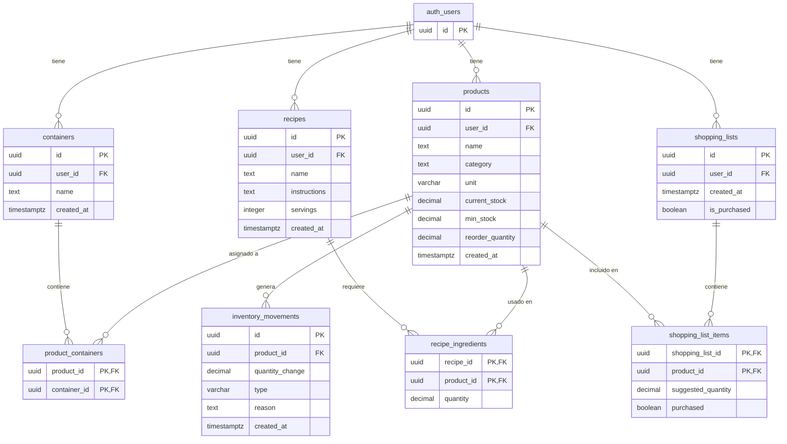

# NIDO SmartHome — Base de datos

> **Grupo 303**: Alejandro Pedrosa, Luciano de la Rubia, Francisco Lopez  
> **Proyecto**: Trabajo Final — UTN  
> **Tipo**: Producto Mínimo Viable (MVP)  
> **Motor**: PostgreSQL (Supabase)

El comportamiento de la API, las pantallas y las reglas de negocio están en [Módulos](modulos.md). Los requerimientos formales y la matriz de trazabilidad se encuentran en [Requerimientos](requerimientos.md).

---

## Tabla de contenidos

1. [Esquema SQL](#1-esquema-sql)
2. [Descripción de tablas](#2-descripción-de-tablas)
3. [Diagrama entidad-relación](#3-diagrama-entidad-relación)
4. [Relaciones](#4-relaciones)
5. [Convenciones](#5-convenciones)
6. [Índices recomendados](#6-índices-recomendados)
7. [Decisiones de diseño tomadas](#7-decisiones-de-diseño-tomadas)

---

## 1. Esquema SQL

> El script DDL ejecutable e independiente para inicializar la base de datos se encuentra en [`docs/database/schema.sql`](database/schema.sql).

```sql
-- ============================================================
-- NIDO SmartHome — Esquema de Base de Datos
-- PostgreSQL + Supabase (Auth)
-- ============================================================

-- Productos del inventario
CREATE TABLE products (
  id UUID PRIMARY KEY DEFAULT gen_random_uuid(),
  user_id UUID NOT NULL REFERENCES auth.users(id) ON DELETE CASCADE,
  name TEXT NOT NULL,
  category TEXT,
  unit VARCHAR(20) NOT NULL DEFAULT 'unidad' CHECK (unit IN ('g', 'kg', 'ml', 'l', 'unidad', 'paquete', 'botella')),
  current_stock DECIMAL(10, 2) NOT NULL DEFAULT 0 CHECK (current_stock >= 0),
  min_stock DECIMAL(10, 2) NOT NULL DEFAULT 0 CHECK (min_stock >= 0),
  reorder_quantity DECIMAL(10, 2) NULL CHECK (reorder_quantity > 0),
  created_at TIMESTAMPTZ NOT NULL DEFAULT NOW(),
  CONSTRAINT uq_products_user_name UNIQUE (user_id, name)
);

-- Contenedores / espacios del hogar
CREATE TABLE containers (
  id UUID PRIMARY KEY DEFAULT gen_random_uuid(),
  user_id UUID NOT NULL REFERENCES auth.users(id) ON DELETE CASCADE,
  name TEXT NOT NULL,
  created_at TIMESTAMPTZ NOT NULL DEFAULT NOW(),
  CONSTRAINT uq_containers_user_name UNIQUE (user_id, name)
);

-- Relación muchos-a-muchos entre productos y contenedores
CREATE TABLE product_containers (
  product_id UUID NOT NULL REFERENCES products(id) ON DELETE CASCADE,
  container_id UUID NOT NULL REFERENCES containers(id) ON DELETE CASCADE,
  PRIMARY KEY (product_id, container_id)
);

-- Recetas
CREATE TABLE recipes (
  id UUID PRIMARY KEY DEFAULT gen_random_uuid(),
  user_id UUID NOT NULL REFERENCES auth.users(id) ON DELETE CASCADE,
  name TEXT NOT NULL,
  instructions TEXT,
  servings INTEGER NOT NULL DEFAULT 1 CHECK (servings > 0),
  created_at TIMESTAMPTZ NOT NULL DEFAULT NOW(),
  CONSTRAINT uq_recipes_user_name UNIQUE (user_id, name)
);

-- Ingredientes de recetas (relación receta-producto)
CREATE TABLE recipe_ingredients (
  recipe_id UUID NOT NULL REFERENCES recipes(id) ON DELETE CASCADE,
  product_id UUID NOT NULL REFERENCES products(id) ON DELETE RESTRICT,
  quantity DECIMAL(10, 2) NOT NULL CHECK (quantity > 0),
  PRIMARY KEY (recipe_id, product_id)
);

-- Movimientos de inventario (auditoría)
CREATE TABLE inventory_movements (
  id UUID PRIMARY KEY DEFAULT gen_random_uuid(),
  product_id UUID NOT NULL REFERENCES products(id) ON DELETE CASCADE,
  quantity_change DECIMAL(10, 2) NOT NULL CHECK (quantity_change != 0),
  type VARCHAR(20) NOT NULL CHECK (type IN ('manual', 'recipe_consumption', 'shopping')),
  reason TEXT,
  created_at TIMESTAMPTZ NOT NULL DEFAULT NOW()
);

-- Listas de compras
CREATE TABLE shopping_lists (
  id UUID PRIMARY KEY DEFAULT gen_random_uuid(),
  user_id UUID NOT NULL REFERENCES auth.users(id) ON DELETE CASCADE,
  created_at TIMESTAMPTZ NOT NULL DEFAULT NOW(),
  is_purchased BOOLEAN NOT NULL DEFAULT FALSE
);

-- Items de la lista de compras
CREATE TABLE shopping_list_items (
  shopping_list_id UUID NOT NULL REFERENCES shopping_lists(id) ON DELETE CASCADE,
  product_id UUID NOT NULL REFERENCES products(id) ON DELETE CASCADE,
  suggested_quantity DECIMAL(10, 2) NOT NULL CHECK (suggested_quantity > 0),
  purchased BOOLEAN NOT NULL DEFAULT FALSE,
  PRIMARY KEY (shopping_list_id, product_id)
);

-- Garantizar una única lista de compras activa por usuario
CREATE UNIQUE INDEX shopping_lists_one_active_per_user
  ON shopping_lists (user_id)
  WHERE is_purchased = FALSE;
```

`auth.users` la administra Supabase Auth. El esquema de la aplicación solo la referencia mediante foreign keys.

---

## 2. Descripción de tablas

### `products` — Productos del inventario

Almacena cada producto que el usuario gestiona en su hogar. Es la tabla central del sistema.

| Columna | Tipo | Constraint | Descripción |
|---|---|---|---|
| `id` | UUID | PK, auto-generado | Identificador único del producto |
| `user_id` | UUID | FK → `auth.users(id)`, NOT NULL, ON DELETE CASCADE | Dueño del producto |
| `name` | TEXT | NOT NULL | Nombre del producto (ej: "Fideos") |
| `category` | TEXT | NULL | Categoría libre (ej: "Alimentos", "Limpieza"). No hay tabla de categorías |
| `unit` | VARCHAR(20) | NOT NULL, DEFAULT `'unidad'`, CHECK | Unidad de medida (ver regla [UN-01](modulos.md#56-unidades-de-medida)): `g`, `kg`, `ml`, `l`, `unidad`, `paquete`, `botella` |
| `current_stock` | DECIMAL(10,2) | NOT NULL, DEFAULT 0, CHECK (`>= 0`) | Stock actual, expresado en `unit` |
| `min_stock` | DECIMAL(10,2) | NOT NULL, DEFAULT 0, CHECK (`>= 0`) | Umbral mínimo para reposición, en la misma `unit` |
| `reorder_quantity` | DECIMAL(10,2) | NULL, CHECK (`> 0`) | Cantidad fija de reposición. Si es NULL, se usa `min_stock - current_stock` |
| `created_at` | TIMESTAMPTZ | NOT NULL, DEFAULT NOW() | Fecha y hora de creación del registro (UTC) |

Restricción adicional: `CONSTRAINT uq_products_user_name UNIQUE (user_id, name)` impide que un usuario tenga dos productos con el mismo nombre.

### `containers` — Contenedores / espacios

Espacios físicos del hogar donde se almacenan productos (Cocina, Heladera, Freezer, Alacena, Baño, Lavadero).

| Columna | Tipo | Constraint | Descripción |
|---|---|---|---|
| `id` | UUID | PK, auto-generado | Identificador único del contenedor |
| `user_id` | UUID | FK → `auth.users(id)`, NOT NULL, ON DELETE CASCADE | Dueño del contenedor |
| `name` | TEXT | NOT NULL | Nombre del contenedor (ej: "Heladera", "Alacena") |
| `created_at` | TIMESTAMPTZ | NOT NULL, DEFAULT NOW() | Fecha y hora de creación (UTC) |

Restricción adicional: `CONSTRAINT uq_containers_user_name UNIQUE (user_id, name)` impide que un usuario repita el nombre de un contenedor.

### `product_containers` — Relación producto-contenedor

Tabla pivote muchos-a-muchos: un producto puede estar en varios contenedores y un contenedor puede albergar varios productos.

| Columna | Tipo | Constraint | Descripción |
|---|---|---|---|
| `product_id` | UUID | PK (compuesta), FK → `products(id)` ON DELETE CASCADE | Referencia al producto |
| `container_id` | UUID | PK (compuesta), FK → `containers(id)` ON DELETE CASCADE | Referencia al contenedor |

Al borrar un contenedor se remueve el vínculo en esta tabla. El producto persiste en el inventario.

### `recipes` — Recetas

Recetas culinarias del usuario. Los ingredientes viven en `recipe_ingredients` y apuntan a productos del inventario.

| Columna | Tipo | Constraint | Descripción |
|---|---|---|---|
| `id` | UUID | PK, auto-generado | Identificador único de la receta |
| `user_id` | UUID | FK → `auth.users(id)`, NOT NULL, ON DELETE CASCADE | Dueño de la receta |
| `name` | TEXT | NOT NULL | Nombre de la preparación (ej: "Pasta con salsa") |
| `instructions` | TEXT | NULL | Instrucciones de preparación paso a paso |
| `servings` | INTEGER | NOT NULL, DEFAULT 1, CHECK (`> 0`) | Porciones base de referencia |
| `created_at` | TIMESTAMPTZ | NOT NULL, DEFAULT NOW() | Fecha y hora de creación (UTC) |

Restricción adicional: `CONSTRAINT uq_recipes_user_name UNIQUE (user_id, name)` impide que un usuario registre dos recetas con el mismo nombre.

`servings` es de carácter informativo. Cocinar la receta descuenta las cantidades guardadas en `recipe_ingredients`.

### `recipe_ingredients` — Ingredientes de recetas

Vincula una receta con productos del inventario e indica la cantidad requerida en la unidad del producto.

| Columna | Tipo | Constraint | Descripción |
|---|---|---|---|
| `recipe_id` | UUID | PK (compuesta), FK → `recipes(id)` ON DELETE CASCADE | Referencia a la receta |
| `product_id` | UUID | PK (compuesta), FK → `products(id)` ON DELETE RESTRICT | Insumo consumido |
| `quantity` | DECIMAL(10,2) | NOT NULL, CHECK (`> 0`) | Cantidad requerida del ingrediente |

La restricción `ON DELETE RESTRICT` y la regla [RC-06](modulos.md#53-recetas-y-consumo) impiden eliminar un producto si forma parte de una receta activa.

### `inventory_movements` — Movimientos de inventario

Auditoría inmutable de cambios de existencias. Cada mutación en `products.current_stock` genera un registro en la misma transacción.

| Columna | Tipo | Constraint | Descripción |
|---|---|---|---|
| `id` | UUID | PK, auto-generado | Identificador único del movimiento |
| `product_id` | UUID | NOT NULL, FK → `products(id)` ON DELETE CASCADE | Producto auditado |
| `quantity_change` | DECIMAL(10,2) | NOT NULL, CHECK (`!= 0`) | Cantidad (+ entrada, - salida) |
| `type` | VARCHAR(20) | NOT NULL, CHECK | Tipo de movimiento (ver regla [AU-02](modulos.md#57-auditoría-de-movimientos)): `manual`, `recipe_consumption`, `shopping` |
| `reason` | TEXT | NULL | Motivo descriptivo opcional |
| `created_at` | TIMESTAMPTZ | NOT NULL, DEFAULT NOW() | Timestamp exacto del cambio (UTC) |

No posee `user_id` directo; el dueño se resuelve a través de `products.user_id`. La API no expone operaciones de actualización o borrado sobre esta tabla. Si se elimina un producto, su historial se purga en cascada deliberadamente para evitar registros huérfanos.

### `shopping_lists` — Listas de compras

Encabezado de una lista de reposición. No posee nombre; se identifica mediante su fecha de creación.

| Columna | Tipo | Constraint | Descripción |
|---|---|---|---|
| `id` | UUID | PK, auto-generado | Identificador único de la lista |
| `user_id` | UUID | FK → `auth.users(id)`, NOT NULL, ON DELETE CASCADE | Dueño de la lista |
| `created_at` | TIMESTAMPTZ | NOT NULL, DEFAULT NOW() | Fecha y hora de generación (UTC) |
| `is_purchased` | BOOLEAN | NOT NULL, DEFAULT FALSE | `true` cuando la compra fue confirmada |

El índice único parcial `shopping_lists_one_active_per_user` garantiza que exista como máximo una lista abierta (`is_purchased = false`) por usuario.

### `shopping_list_items` — Ítems de la lista de compras

| Columna | Tipo | Constraint | Descripción |
|---|---|---|---|
| `shopping_list_id` | UUID | PK (compuesta), FK → `shopping_lists(id)` ON DELETE CASCADE | Referencia a la lista |
| `product_id` | UUID | PK (compuesta), FK → `products(id)` ON DELETE CASCADE | Referencia al producto |
| `suggested_quantity` | DECIMAL(10,2) | NOT NULL, CHECK (`> 0`) | Cantidad sugerida a comprar, en la unidad del producto |
| `purchased` | BOOLEAN | NOT NULL, DEFAULT FALSE | Indicador de artículo comprado |

---

## 3. Diagrama entidad-relación



---

## 4. Relaciones

| Relación | Tipo | Descripción |
|---|---|---|
| `auth.users` → `products` | 1:N | Un usuario tiene muchos productos. Borrar el usuario borra sus productos en cascada |
| `auth.users` → `containers` | 1:N | Un usuario tiene muchos contenedores |
| `auth.users` → `recipes` | 1:N | Un usuario tiene muchas recetas |
| `auth.users` → `shopping_lists` | 1:N | Un usuario tiene muchas listas de compras |
| `products` ↔ `containers` | M:N | Vía tabla pivote `product_containers` |
| `recipes` ↔ `products` | M:N | Vía `recipe_ingredients`, con cantidad requerida |
| `products` → `inventory_movements` | 1:N | Un producto registra su historial de auditoría |
| `shopping_lists` ↔ `products` | M:N | Vía `shopping_list_items`, con cantidad sugerida y estado de compra |

---

## 5. Convenciones

| Elemento | Convención | Ejemplo |
|---|---|---|
| Tablas | snake_case, plural | `products`, `shopping_lists` |
| Columnas | snake_case | `current_stock`, `user_id` |
| Claves primarias | `id UUID` con `gen_random_uuid()`, salvo pivotes | `products.id` |
| Pivotes | Clave primaria compuesta por las dos FK | `(recipe_id, product_id)` |
| Dueño | `user_id` → `auth.users(id)` en toda tabla que no sea pivote ni movimiento | `containers.user_id` |
| Cantidades | `DECIMAL(10, 2)`, en la misma unidad que `products.unit` | `current_stock`, `quantity` |
| Borrado | `ON DELETE CASCADE` desde el padre, salvo productos en recetas (`RESTRICT`) | Borrar un producto elimina sus movimientos e ítems de compra |
| Zona horaria | `TIMESTAMPTZ` con valor por defecto `NOW()` en todas las marcas temporales | `products.created_at` |

Estados derivados de stock (no se persisten). Las condiciones son mutuamente excluyentes y se evalúan en orden de precedencia:

| Prioridad | Condición | Estado |
|---|---|---|
| 1 | `current_stock = 0` | Sin stock |
| 2 | `current_stock > 0 AND current_stock < min_stock` | Bajo mínimo |
| 3 | `current_stock > 0 AND current_stock >= min_stock` | OK |

---

## 6. Índices recomendados

PostgreSQL no indexa automáticamente las columnas de una foreign key. Las consultas del sistema filtran por usuario y por producto:

```sql
CREATE INDEX products_user_id_idx ON products (user_id);
CREATE INDEX containers_user_id_idx ON containers (user_id);
CREATE INDEX recipes_user_id_idx ON recipes (user_id);
CREATE INDEX shopping_lists_user_id_idx ON shopping_lists (user_id);
CREATE INDEX inventory_movements_product_id_idx ON inventory_movements (product_id);
CREATE INDEX recipe_ingredients_product_id_idx ON recipe_ingredients (product_id);
CREATE INDEX shopping_list_items_product_id_idx ON shopping_list_items (product_id);
CREATE INDEX product_containers_container_id_idx ON product_containers (container_id);
```

`product_containers.product_id` ya queda cubierto por la primary key compuesta `(product_id, container_id)`.

---

## 7. Decisiones de diseño tomadas

En base a la revisión técnica del diseño de datos previa a la codificación, se formalizaron las siguientes definiciones:

**Lógica transaccional en la API vs. Triggers.** La orquestación de transacciones complejas (descuento atómico de múltiples insumos al cocinar, liquidación de compras y control de concurrencia mediante `FOR UPDATE`) se implementa en los servicios de NestJS mediante un pool directo de Node-Postgres (`pg`). Esto garantiza trazabilidad, permite responder con códigos HTTP semánticos (400, 404, 409) y facilita las pruebas unitarias e integradas dentro del pipeline de CI/CD sin acoplar lógica a procedimientos almacenados en la base de datos.

**Aislamiento multi-inquilino en la aplicación vs. RLS.** La API actúa como guardián estricto: toda consulta SQL generada por el backend incluye el predicado `WHERE user_id = $1`, donde el valor se extrae directamente del JWT validado por `SupabaseAuthGuard`. En las tablas pivote (`product_containers`, `recipe_ingredients`) y en `inventory_movements`, el servicio valida que las entidades vinculadas pertenezcan al usuario autenticado antes de persistir, respondiendo HTTP 404 ante inconsistencias para no revelar la existencia de recursos ajenos.

**Restricciones de integridad en base de datos.** Se incorporaron restricciones `CHECK` en el script SQL para validar los valores permitidos de `unit` (`'g', 'kg', 'ml', 'l', 'unidad', 'paquete', 'botella'`), `inventory_movements.type` (`'manual', 'recipe_consumption', 'shopping'`), y la no negatividad o positividad estricta de existencias y porciones (`current_stock >= 0`, `min_stock >= 0`, `reorder_quantity > 0`, `quantity > 0`, `suggested_quantity > 0`, `servings > 0`).

**Auditoría y borrado en cascada.** `inventory_movements` mantiene `ON DELETE CASCADE` hacia `products`. Para el alcance de este MVP, la eliminación de un producto representa una decisión del usuario de purgar dicho elemento del hogar, por lo que su historial se remueve deliberadamente junto con el registro principal para evitar registros huérfanos. En contraposición, los productos asociados a recetas activas están protegidos por `ON DELETE RESTRICT` (regla [RC-06](modulos.md#53-recetas-y-consumo)).

**Zona horaria.** Todas las columnas temporales usan `TIMESTAMPTZ` para almacenar fecha y hora en UTC, garantizando independencia respecto a la zona horaria del servidor o de los clientes.

**Unificación de unidades y presentación de compra.** Se descartó el modelado de presentaciones comerciales intermedias para el MVP; todo producto opera en una única unidad de stock (`unit`), estandarizando el uso de `g` en toda la base y documentación.

**Categorías.** `products.category` es texto libre para mantener simple la interfaz inicial, sin tabla adicional de catálogo.

**Una lista activa.** La garantía de no duplicar listas de compras abiertas se implementa a nivel relacional mediante el índice único parcial `shopping_lists_one_active_per_user` (`WHERE is_purchased = FALSE`).
