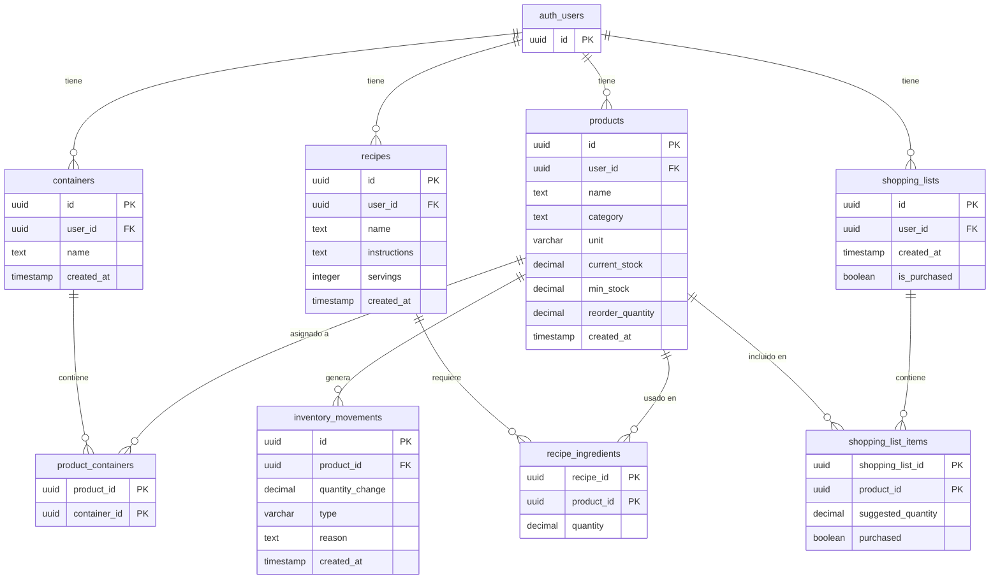

# NIDO SmartHome — Base de datos

> **Grupo 303**: Alejandro Pedrosa, Luciano de la Rubia, Francisco Lopez
> **Proyecto**: Trabajo Final — UTN
> **Tipo**: Producto Mínimo Viable (MVP)
> **Motor**: PostgreSQL (Supabase)

El comportamiento de la API, las pantallas y las reglas de negocio están en [Módulos](modulos.md).

---

## Tabla de contenidos

1. [Esquema SQL](#1-esquema-sql)
2. [Descripción de tablas](#2-descripción-de-tablas)
3. [Diagrama entidad-relación](#3-diagrama-entidad-relación)
4. [Relaciones](#4-relaciones)
5. [Convenciones](#5-convenciones)
6. [Índices recomendados](#6-índices-recomendados)
7. [Observaciones](#7-observaciones)

---

## 1. Esquema SQL

```sql
-- ============================================================
-- NIDO SmartHome — Esquema de Base de Datos
-- PostgreSQL + Supabase (Auth)
-- ============================================================

-- Productos del inventario
CREATE TABLE products (
  id UUID PRIMARY KEY DEFAULT gen_random_uuid(),
  user_id UUID NOT NULL REFERENCES auth.users(id) ON DELETE CASCADE,
  name TEXT NOT NULL,
  category TEXT,
  unit VARCHAR(20) DEFAULT 'unidad', -- 'gr', 'kg', 'ml', 'l', 'unidad', 'paquete', 'botella'
  current_stock DECIMAL(10, 2) DEFAULT 0,
  min_stock DECIMAL(10, 2) DEFAULT 0,
  reorder_quantity DECIMAL(10, 2) NULL,
  created_at TIMESTAMP DEFAULT NOW()
);

-- Contenedores / espacios del hogar
CREATE TABLE containers (
  id UUID PRIMARY KEY DEFAULT gen_random_uuid(),
  user_id UUID NOT NULL REFERENCES auth.users(id) ON DELETE CASCADE,
  name TEXT NOT NULL,
  created_at TIMESTAMP DEFAULT NOW()
);

-- Relación muchos-a-muchos entre productos y contenedores
CREATE TABLE product_containers (
  product_id UUID REFERENCES products(id) ON DELETE CASCADE,
  container_id UUID REFERENCES containers(id) ON DELETE CASCADE,
  PRIMARY KEY (product_id, container_id)
);

-- Recetas
CREATE TABLE recipes (
  id UUID PRIMARY KEY DEFAULT gen_random_uuid(),
  user_id UUID NOT NULL REFERENCES auth.users(id) ON DELETE CASCADE,
  name TEXT NOT NULL,
  instructions TEXT,
  servings INTEGER DEFAULT 1,
  created_at TIMESTAMP DEFAULT NOW()
);

-- Ingredientes de recetas (relación receta-producto)
CREATE TABLE recipe_ingredients (
  recipe_id UUID REFERENCES recipes(id) ON DELETE CASCADE,
  product_id UUID REFERENCES products(id) ON DELETE CASCADE,
  quantity DECIMAL(10, 2) NOT NULL,
  PRIMARY KEY (recipe_id, product_id)
);

-- Movimientos de inventario (auditoría)
CREATE TABLE inventory_movements (
  id UUID PRIMARY KEY DEFAULT gen_random_uuid(),
  product_id UUID REFERENCES products(id) ON DELETE CASCADE,
  quantity_change DECIMAL(10, 2) NOT NULL,
  type VARCHAR(20) NOT NULL, -- 'manual', 'recipe_consumption', 'shopping'
  reason TEXT,
  created_at TIMESTAMP DEFAULT NOW()
);

-- Listas de compras
CREATE TABLE shopping_lists (
  id UUID PRIMARY KEY DEFAULT gen_random_uuid(),
  user_id UUID NOT NULL REFERENCES auth.users(id) ON DELETE CASCADE,
  created_at TIMESTAMP DEFAULT NOW(),
  is_purchased BOOLEAN DEFAULT FALSE
);

-- Items de la lista de compras
CREATE TABLE shopping_list_items (
  shopping_list_id UUID REFERENCES shopping_lists(id) ON DELETE CASCADE,
  product_id UUID REFERENCES products(id) ON DELETE CASCADE,
  suggested_quantity DECIMAL(10, 2) NOT NULL,
  purchased BOOLEAN DEFAULT FALSE,
  PRIMARY KEY (shopping_list_id, product_id)
);
```

`auth.users` la administra Supabase Auth. El esquema de la aplicación solo la referencia.

---

## 2. Descripción de tablas

### `products` — Productos del inventario

Almacena cada producto que el usuario gestiona en su hogar. Es la tabla central del sistema.

| Columna | Tipo | Constraint | Descripción |
|---------|------|------------|-------------|
| `id` | UUID | PK, auto-generado | Identificador único del producto |
| `user_id` | UUID | FK → `auth.users(id)`, NOT NULL, ON DELETE CASCADE | Dueño del producto |
| `name` | TEXT | NOT NULL | Nombre del producto (ej: "Fideos") |
| `category` | TEXT | NULL | Categoría libre (ej: "Alimentos", "Limpieza"). No hay tabla de categorías |
| `unit` | VARCHAR(20) | DEFAULT `'unidad'` | Unidad de medida: `gr`, `kg`, `ml`, `l`, `unidad`, `paquete`, `botella` |
| `current_stock` | DECIMAL(10,2) | DEFAULT 0 | Stock actual, expresado en `unit` |
| `min_stock` | DECIMAL(10,2) | DEFAULT 0 | Umbral mínimo para alertas de reposición, en la misma `unit` |
| `reorder_quantity` | DECIMAL(10,2) | NULL | Cantidad sugerida al reponer. Si es NULL, se usa `min_stock - current_stock` |
| `created_at` | TIMESTAMP | DEFAULT NOW() | Fecha de creación del registro |

### `containers` — Contenedores / espacios

Espacios físicos del hogar donde se almacenan productos (Cocina, Heladera, Freezer, Alacena, Baño, Lavadero).

| Columna | Tipo | Constraint | Descripción |
|---------|------|------------|-------------|
| `id` | UUID | PK, auto-generado | Identificador único del contenedor |
| `user_id` | UUID | FK → `auth.users(id)`, NOT NULL, ON DELETE CASCADE | Dueño del contenedor |
| `name` | TEXT | NOT NULL | Nombre del contenedor (ej: "Heladera", "Alacena") |
| `created_at` | TIMESTAMP | DEFAULT NOW() | Fecha de creación |

### `product_containers` — Relación producto-contenedor

Tabla pivote muchos-a-muchos: un producto puede estar en varios contenedores y un contenedor puede tener varios productos.

| Columna | Tipo | Constraint | Descripción |
|---------|------|------------|-------------|
| `product_id` | UUID | PK (compuesta), FK → `products(id)` ON DELETE CASCADE | Referencia al producto |
| `container_id` | UUID | PK (compuesta), FK → `containers(id)` ON DELETE CASCADE | Referencia al contenedor |

Al borrar un contenedor se borra la fila de esta tabla. El producto sigue existiendo.

### `recipes` — Recetas

Recetas del usuario. Los ingredientes viven en `recipe_ingredients` y apuntan a productos del inventario.

| Columna | Tipo | Constraint | Descripción |
|---------|------|------------|-------------|
| `id` | UUID | PK, auto-generado | Identificador único de la receta |
| `user_id` | UUID | FK → `auth.users(id)`, NOT NULL, ON DELETE CASCADE | Dueño de la receta |
| `name` | TEXT | NOT NULL | Nombre de la receta (ej: "Pasta con salsa") |
| `instructions` | TEXT | NULL | Instrucciones de preparación |
| `servings` | INTEGER | DEFAULT 1 | Cantidad de porciones que cubren las cantidades de `recipe_ingredients` |
| `created_at` | TIMESTAMP | DEFAULT NOW() | Fecha de creación |

`servings` es informativo. Cocinar la receta descuenta las cantidades guardadas en `recipe_ingredients`, sin multiplicar por porciones.

### `recipe_ingredients` — Ingredientes de recetas

Vincula una receta con productos del inventario e indica la cantidad necesaria de cada uno, en la unidad del producto.

| Columna | Tipo | Constraint | Descripción |
|---------|------|------------|-------------|
| `recipe_id` | UUID | PK (compuesta), FK → `recipes(id)` ON DELETE CASCADE | Referencia a la receta |
| `product_id` | UUID | PK (compuesta), FK → `products(id)` ON DELETE CASCADE | Referencia al producto |
| `quantity` | DECIMAL(10,2) | NOT NULL | Cantidad necesaria del ingrediente |

La clave primaria impide repetir el mismo producto dentro de una receta.

### `inventory_movements` — Movimientos de inventario

Auditoría de cambios de stock. Cada entrada o salida de `products.current_stock` genera una fila.

| Columna | Tipo | Constraint | Descripción |
|---------|------|------------|-------------|
| `id` | UUID | PK, auto-generado | Identificador único del movimiento |
| `product_id` | UUID | FK → `products(id)` ON DELETE CASCADE | Producto afectado |
| `quantity_change` | DECIMAL(10,2) | NOT NULL | Positivo = entrada, negativo = salida |
| `type` | VARCHAR(20) | NOT NULL | `manual`, `recipe_consumption` o `shopping` |
| `reason` | TEXT | NULL | Motivo opcional |
| `created_at` | TIMESTAMP | DEFAULT NOW() | Fecha del movimiento |

No tiene `user_id`. El dueño se obtiene por `products.user_id`. La API no actualiza ni borra estas filas. Si se elimina el producto (o el usuario, que borra sus productos en cascada), el historial de ese producto también se borra.

### `shopping_lists` — Listas de compras

Encabezado de una lista. No tiene nombre: se identifica por fecha de creación.

| Columna | Tipo | Constraint | Descripción |
|---------|------|------------|-------------|
| `id` | UUID | PK, auto-generado | Identificador único de la lista |
| `user_id` | UUID | FK → `auth.users(id)`, NOT NULL, ON DELETE CASCADE | Dueño de la lista |
| `created_at` | TIMESTAMP | DEFAULT NOW() | Fecha de creación |
| `is_purchased` | BOOLEAN | DEFAULT FALSE | `true` cuando la compra fue confirmada |

Como máximo hay una lista activa por usuario (`is_purchased = false`). La generación automática actualiza esa lista en lugar de crear otra. El esquema no impone ese límite: lo valida el backend.

### `shopping_list_items` — Ítems de la lista de compras

| Columna | Tipo | Constraint | Descripción |
|---------|------|------------|-------------|
| `shopping_list_id` | UUID | PK (compuesta), FK → `shopping_lists(id)` ON DELETE CASCADE | Referencia a la lista |
| `product_id` | UUID | PK (compuesta), FK → `products(id)` ON DELETE CASCADE | Referencia al producto |
| `suggested_quantity` | DECIMAL(10,2) | NOT NULL | Cantidad sugerida para comprar, en la unidad del producto |
| `purchased` | BOOLEAN | DEFAULT FALSE | Ítem marcado como comprado |

---

## 3. Diagrama entidad-relación



---

## 4. Relaciones

| Relación | Tipo | Descripción |
|----------|------|-------------|
| `auth.users` → `products` | 1:N | Un usuario tiene muchos productos. Borrar el usuario borra sus productos |
| `auth.users` → `containers` | 1:N | Un usuario tiene muchos contenedores |
| `auth.users` → `recipes` | 1:N | Un usuario tiene muchas recetas |
| `auth.users` → `shopping_lists` | 1:N | Un usuario tiene muchas listas de compras |
| `products` ↔ `containers` | M:N | Vía `product_containers` |
| `recipes` ↔ `products` | M:N | Vía `recipe_ingredients`, con cantidad |
| `products` → `inventory_movements` | 1:N | Un producto tiene muchos movimientos de stock |
| `shopping_lists` ↔ `products` | M:N | Vía `shopping_list_items`, con cantidad sugerida y estado de compra |

---

## 5. Convenciones

| Elemento | Convención | Ejemplo |
|----------|------------|---------|
| Tablas | snake_case, plural | `products`, `shopping_lists` |
| Columnas | snake_case | `current_stock`, `user_id` |
| Claves primarias | `id UUID` con `gen_random_uuid()`, salvo pivotes | `products.id` |
| Pivotes | Clave primaria compuesta por las dos FK | `(recipe_id, product_id)` |
| Dueño | `user_id` → `auth.users(id)` en toda tabla que no sea pivote ni movimiento | `containers.user_id` |
| Cantidades | `DECIMAL(10, 2)`, misma unidad que `products.unit` | `current_stock`, `quantity` |
| Borrado | `ON DELETE CASCADE` desde el padre | Borrar un producto borra sus ingredientes, movimientos e ítems de compra |

Estados derivados de stock (no se persisten):

| Condición | Estado |
|-----------|--------|
| `current_stock >= min_stock` | OK |
| `0 < current_stock < min_stock` | Bajo mínimo |
| `current_stock = 0` | Sin stock |

---

## 6. Índices recomendados

PostgreSQL no indexa automáticamente las columnas de una foreign key. Las consultas del MVP filtran por dueño y por producto:

```sql
CREATE INDEX products_user_id_idx ON products (user_id);
CREATE INDEX containers_user_id_idx ON containers (user_id);
CREATE INDEX recipes_user_id_idx ON recipes (user_id);
CREATE INDEX shopping_lists_user_id_idx ON shopping_lists (user_id);
CREATE INDEX inventory_movements_product_id_idx ON inventory_movements (product_id);
CREATE INDEX recipe_ingredients_product_id_idx ON recipe_ingredients (product_id);
CREATE INDEX shopping_list_items_product_id_idx ON shopping_list_items (product_id);
CREATE INDEX product_containers_container_id_idx ON product_containers (container_id);
```

`product_containers.product_id` ya queda cubierto por la primary key compuesta `(product_id, container_id)`.

---

## 7. Observaciones

Estas decisiones quedan afuera del `CREATE TABLE` y las tiene que cubrir el backend, o hay que cambiar el esquema antes de implementar.

**Aislamiento.** No hay políticas RLS en este script. Cada query de la API filtra por el `user_id` del JWT. Las tablas pivote y `inventory_movements` no tienen `user_id`: al insertar, el backend comprueba que el producto, el contenedor y la receta pertenezcan al mismo usuario.

**Valores permitidos.** `unit` y `inventory_movements.type` no tienen `CHECK`. Los valores válidos están en las reglas [UN-01](modulos.md#36-unidades-de-medida) y [AU-02](modulos.md#37-auditoría-de-movimientos). `current_stock >= 0` tampoco está en la base: lo rechaza la API (regla RS-03).

**Zona horaria.** `created_at` es `TIMESTAMP` (sin zona). En Supabase conviene `TIMESTAMPTZ` para no depender de la zona del servidor.

**Presentación de compra.** El alcance del README describe una presentación habitual (por ejemplo, "paquete de 500 g") distinta de la unidad de stock. Este esquema no tiene esa columna: stock, mínimo, reposición e ingredientes usan siempre `products.unit`.

**Categorías.** `products.category` es texto libre. No existe un catálogo ni una pantalla de administración de categorías.

**Una lista activa.** La regla de no duplicar listas de compras no está en el esquema. Hace falta un índice único parcial, o la validación en el servicio:

```sql
CREATE UNIQUE INDEX shopping_lists_one_active_per_user
  ON shopping_lists (user_id)
  WHERE is_purchased = false;
```
