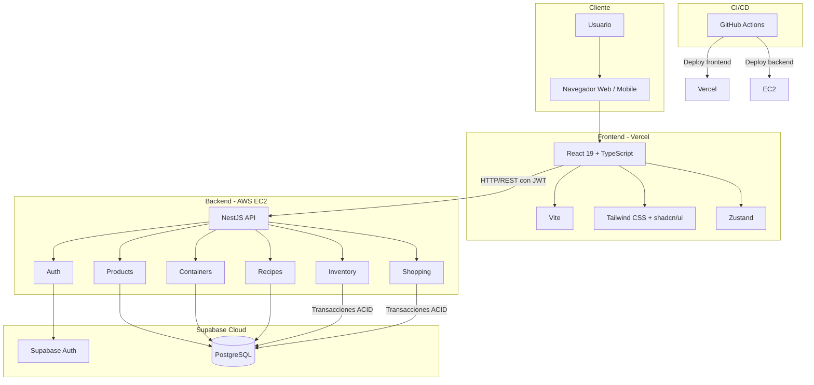
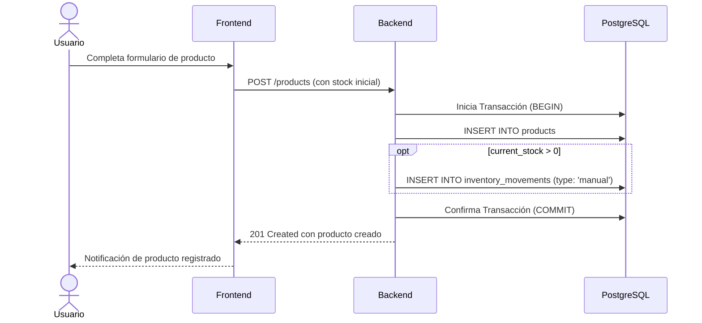
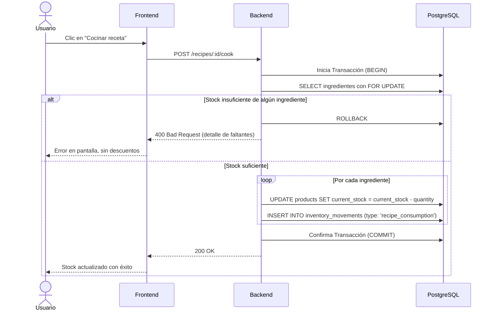
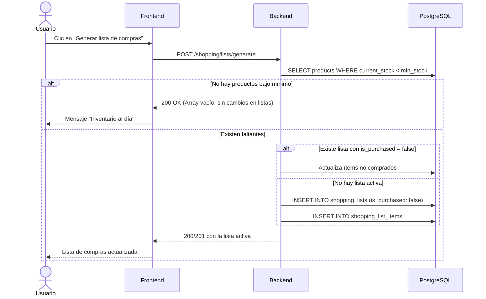
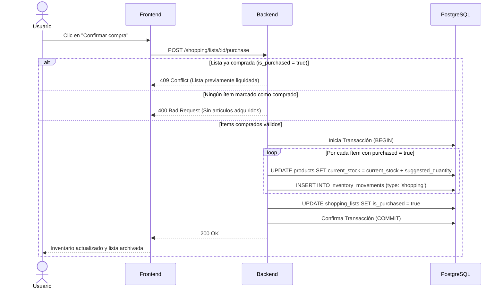
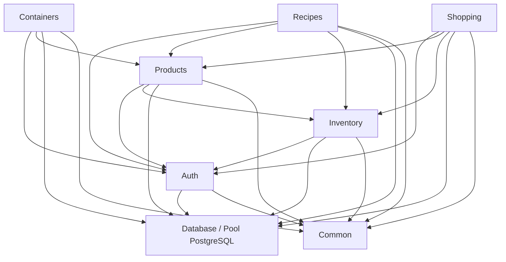
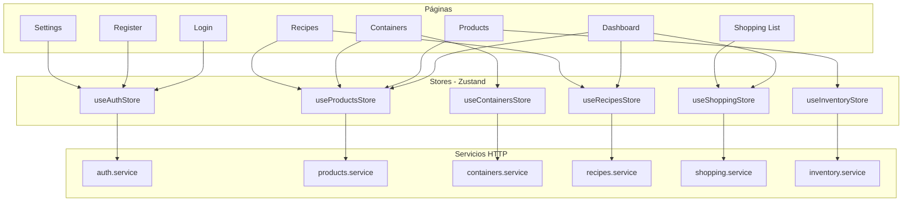

# NIDO SmartHome — Módulos

> **Grupo 303**: Alejandro Pedrosa, Luciano de la Rubia, Francisco Lopez  
> **Proyecto**: Trabajo Final — UTN  
> **Tipo**: Producto Mínimo Viable (MVP)

El esquema, las tablas y las relaciones están en [Base de datos](base-de-datos.md). Los requerimientos formales y la matriz de trazabilidad están en [Requerimientos](requerimientos.md).

---

## Tabla de contenidos

1. [Estructura del repositorio](#1-estructura-del-repositorio)
2. [Backend (NestJS)](#2-backend-nestjs)
3. [Frontend (React)](#3-frontend-react)
4. [Stores (Zustand)](#4-stores-zustand)
5. [Reglas de negocio](#5-reglas-de-negocio)
6. [Arquitectura](#6-arquitectura)
7. [Flujos de datos](#7-flujos-de-datos)
8. [Dependencias entre módulos](#8-dependencias-entre-módulos)
9. [Apéndice](#9-apéndice)

---

## 1. Estructura del repositorio

```text
nido-smarthome/
├── apps/
│   ├── frontend/          # React + Vite
│   │   ├── src/
│   │   │   ├── components/    # Componentes reutilizables (shadcn/ui)
│   │   │   ├── pages/         # Páginas/vistas
│   │   │   ├── stores/        # Zustand stores
│   │   │   ├── services/      # Clientes HTTP
│   │   │   ├── hooks/         # Custom hooks
│   │   │   ├── types/         # Tipos TypeScript
│   │   │   └── lib/           # Utilidades
│   │   └── ...
│   └── backend/           # NestJS
│       ├── src/
│       │   ├── auth/          # Autenticación y ciclo de vida de tokens
│       │   ├── products/      # Productos
│       │   ├── containers/    # Contenedores
│       │   ├── recipes/       # Recetas
│       │   ├── inventory/     # Movimientos de stock y transacciones directas
│       │   ├── shopping/      # Listas de compras
│       │   ├── common/        # Guards, interceptors, pipes
│       │   └── database/      # Cliente Supabase y Pool PostgreSQL
│       └── ...
├── docs/
├── .github/workflows/
└── README.md
```

---

## 2. Backend (NestJS)

Las rutas de esta sección son las del controlador, sin prefijo global. Las rutas literales (`/products/low-stock`, `/recipes/available`) se declaran antes que `/:id`, para que NestJS no las tome como un identificador.

Todas las rutas privadas exigen el JWT de Supabase. El `user_id` se extrae siempre del token validado, nunca del cuerpo de la petición.

### Persistencia, Transacciones y Concurrencia

* **Transacciones ACID:** Debido a que la biblioteca cliente `supabase-js` no admite transacciones de múltiples sentencias desde el backend, las mutaciones compuestas (alta de producto con stock inicial, consumo de recetas y confirmación de listas de compras) se ejecutan mediante una conexión directa a PostgreSQL usando un pool transaccional de Node-Postgres (`pg`) administrado en el módulo `database`. El cliente `supabase-js` se utiliza para la autenticación y operaciones atómicas estándar.
* **Control de concurrencia al cocinar:** Para evitar inconsistencias de inventario o stocks negativos derivados de dos consumos simultáneos, el descuento de stock en `POST /recipes/:id/cook` se realiza dentro de la transacción ejecutando un bloqueo pesimista de filas (`SELECT current_stock FROM products WHERE id = $1 FOR UPDATE`) o una actualización condicional indivisible:
  ```sql
  UPDATE products
  SET current_stock = current_stock - $1
  WHERE id = $2 AND current_stock >= $1;
  ```
  Si alguna de las filas afectadas devuelve cero registros actualizados (stock insuficiente en el momento de la mutación), se ejecuta `ROLLBACK` total y se responde con código HTTP 400.

---

### Módulo `auth` — Autenticación

Gestión de usuarios, control de sesiones y tokens con Supabase Auth.

**Responsabilidades**:

- Registro e inicio de sesión con email y contraseña
- Emisión, validación y renovación de tokens JWT
- Guard reutilizable (`SupabaseAuthGuard`) para proteger rutas privadas
- Al registrar un usuario, precargar automáticamente los contenedores sugeridos (Cocina, Heladera, Freezer, Alacena, Baño, Lavadero)

**Endpoints**:

| Método | Ruta | Descripción |
|--------|------|-------------|
| POST | `/auth/register` | Registrar usuario y crear contenedores sugeridos |
| POST | `/auth/login` | Iniciar sesión y retornar access token (JWT) junto con refresh token |
| POST | `/auth/refresh` | Renovar el access token (JWT) utilizando el refresh token activo |
| POST | `/auth/logout` | Cerrar sesión e invalidar tokens |
| GET | `/auth/me` | Obtener datos del usuario actual autenticado |

**Piezas**:

- `SupabaseAuthGuard` — valida la firma y vigencia del JWT
- `CurrentUser` — decorador que expone el `user_id` autenticado extraído de la request

---

### Módulo `products` — Productos

CRUD de productos y consulta de stock. Cada alta con stock inicial, ajuste o consumo pasa por `inventory`, que actualiza `current_stock` e inserta el movimiento correspondiente de manera indivisible.

**Responsabilidades**:

- Crear, leer, actualizar y eliminar productos
- Configuración de stock mínimo y cantidad sugerida de reposición
- Filtros por categoría, nombre, condición de stock bajo y contenedor asignado
- Validación de integridad: bloqueo de eliminación si el producto pertenece a recetas activas

**Endpoints**:

| Método | Ruta | Descripción |
|--------|------|-------------|
| GET | `/products` | Listar productos del usuario (filtros opcionales: `category`, `name`, `low_stock`, `container_id`) |
| GET | `/products/low-stock` | Productos con `current_stock < min_stock` |
| GET | `/products/:id` | Producto por ID (solo si pertenece al usuario) |
| POST | `/products` | Crear producto (si `current_stock > 0`, registra movimiento inicial transaccional) |
| PATCH | `/products/:id` | Actualizar metadatos del producto (nombre, categoría, unidad, mínimos; no el stock) |
| DELETE | `/products/:id` | Eliminar producto (responde 409 si es ingrediente de recetas; si no, borra producto e historial) |

**Piezas**:

- `ProductsService` — lógica de negocio y validación de unicidad por nombre
- `ProductsController` — endpoints REST
- `ProductsRepository` — capa de acceso a datos

---

### Módulo `containers` — Contenedores

Espacios físicos del hogar y asignación de inventario.

**Responsabilidades**:

- CRUD de contenedores del hogar
- Asignar y desasignar productos existentes del mismo usuario
- Listar los productos de un contenedor específico

**Endpoints**:

| Método | Ruta | Descripción |
|--------|------|-------------|
| GET | `/containers` | Listar contenedores del usuario |
| GET | `/containers/:id` | Contenedor con sus productos asociados |
| POST | `/containers` | Crear contenedor (valida nombre único por usuario) |
| PATCH | `/containers/:id` | Actualizar contenedor |
| DELETE | `/containers/:id` | Eliminar contenedor (remueve la relación pivote, los productos persisten) |
| POST | `/containers/:id/products` | Asignar un producto del mismo usuario |
| DELETE | `/containers/:id/products/:productId` | Desasignar producto del contenedor |

---

### Módulo `recipes` — Recetas

Gestión de recetas culinarias, ingredientes vinculados al inventario y preparación con descuento atómico.

**Responsabilidades**:

- CRUD de recetas, instrucciones y porciones
- Asociación obligatoria de al menos un ingrediente por receta
- Validación de recetas disponibles basadas en existencias
- Preparación transaccional con control de concurrencia y descuento de insumos

**Endpoints**:

| Método | Ruta | Descripción |
|--------|------|-------------|
| GET | `/recipes` | Listar recetas del usuario |
| GET | `/recipes/available` | Recetas cuyo stock cubre todos los ingredientes requeridos |
| GET | `/recipes/:id` | Receta detallada con sus ingredientes |
| POST | `/recipes` | Crear receta (exige al menos un ingrediente propio) |
| PATCH | `/recipes/:id` | Actualizar receta e ingredientes |
| DELETE | `/recipes/:id` | Eliminar receta y sus dependencias en cascada |
| POST | `/recipes/:id/cook` | Preparar plato de forma atómica y registrar auditoría de consumo |

---

### Módulo `inventory` — Movimientos

Registro indivisible de cada cambio de inventario. Gestiona la transacción directa con PostgreSQL.

**Responsabilidades**:

- Ajuste manual de entrada o salida con validación de no negatividad
- Historial filtrado por producto, tipo y fecha
- Servicio interno transaccional consumido por `recipes` y `shopping`

**Endpoints**:

| Método | Ruta | Descripción |
|--------|------|-------------|
| GET | `/inventory/movements` | Movimientos del usuario (filtros por producto, tipo y fecha) |
| GET | `/inventory/movements/:productId` | Historial de auditoría de un producto específico |
| POST | `/inventory/adjust` | Ajuste manual (tipo `manual`; rechaza stock resultante negativo) |

---

### Módulo `shopping` — Listas de compras

Generación consolidada y liquidación de listas de reposición.

**Responsabilidades**:

- Armar la lista con productos bajo mínimo (`current_stock < min_stock`)
- Mantener como máximo una lista activa (`is_purchased = false`)
- Preservar ítems ya marcados al regenerar la lista activa
- Liquidar compras ingresando stock únicamente de artículos marcados

**Endpoints**:

| Método | Ruta | Descripción |
|--------|------|-------------|
| GET | `/shopping/lists` | Listar histórico de listas de compras del usuario |
| GET | `/shopping/lists/:id` | Obtener lista detallada con sus ítems |
| POST | `/shopping/lists/generate` | Generar o sincronizar la lista activa (responde vacío si no hay faltantes) |
| PATCH | `/shopping/lists/:id/items/:productId` | Marcar o desmarcar un ítem como comprado (`purchased`) |
| POST | `/shopping/lists/:id/purchase` | Confirmar compra de ítems marcados, sumar a stock y cerrar lista |

---

## 3. Frontend (React)

### Protección de Rutas

El acceso a las rutas privadas (`/dashboard`, `/products`, `/containers`, `/recipes`, `/shopping-list`, `/settings`) está protegido por un componente envoltorio `ProtectedRoute`. Si no existe un token de sesión válido en `useAuthStore`, el usuario es redirigido automáticamente a `/login`, recordando la ruta de origen. Las rutas públicas `/login` y `/register` redirigen directamente a `/dashboard` si el usuario ya posee sesión activa.

### Páginas y Componentes

#### Página `Login` (`/login`)
- `LoginForm` — Formulario de autenticación con email y contraseña
- Manejo de errores de credenciales (HTTP 401) y enlace de navegación hacia `/register`

#### Página `Register` (`/register`)
- `RegisterForm` — Formulario de alta con validación de contraseña
- Creación de cuenta y redirección inicial al dashboard con contenedores base precargados

#### Página `Dashboard` (`/dashboard`)
- Indicadores métricos generales (total de productos, alertas de stock bajo)
- `LowStockPreview` — Vista rápida de productos bajo mínimo
- `ActiveShoppingListCard` — Acceso directo y estado de la lista de compras activa
- `AvailableRecipesPreview` — Acceso a recetas preparables con el stock disponible actual

#### Página `Products` (`/products`)
- `ProductList` — Tabla con búsqueda, filtros por categoría, contenedor y estado de stock
- `ProductForm` — Modal de alta y edición de metadatos (sin editar stock directamente)
- `ProductDetail` — Visualización de datos y panel de historial de auditoría
- `StockAdjuster` — Modal de ajuste manual rápido de entrada/salida
- `LowStockAlert` — Filtro rápido de productos bajo mínimo

#### Página `Containers` (`/containers`)
- `ContainerList` — Tarjetas de contenedores con contador de productos
- `ContainerDetail` — Vista de productos asignados al espacio físico
- `ContainerForm` — Alta y edición de nombre de contenedor
- `ProductAssigner` — Selector para asociar o desvincular productos del contenedor

#### Página `Recipes` (`/recipes`)
- `RecipeList` — Grilla de recetas creadas
- `RecipeForm` — Formulario de alta y edición con selector dinámico de ingredientes propios y cantidades
- `RecipeDetail` — Visualización de ingredientes e instrucciones paso a paso
- `CookButton` — Botón de preparación con confirmación modal y control de stock
- `AvailableRecipes` — Filtro específico de recetas cocinables con el stock del momento

#### Página `ShoppingList` (`/shopping-list`)
- `ShoppingListView` — Tabla de la lista de compras activa y detalle de listas históricas
- `GenerateListButton` — Botón para sincronizar o generar la lista de compras con los faltantes
- `ShoppingItemCard` — Casilla de verificación para marcar ítems comprados
- `PurchaseConfirm` — Acción de confirmación que liquida la compra e incrementa el stock

#### Página `Settings` (`/settings`)
- Información del perfil autenticado (`GET /auth/me`)
- Botón de cierre de sesión (`POST /auth/logout`)

---

## 4. Stores (Zustand)

| Store | Responsabilidad |
|---|---|
| `useAuthStore` | Sesión activa, usuario, access token, refresh token y método de renovación |
| `useProductsStore` | Catálogo de productos, filtros aplicados y producto seleccionado |
| `useContainersStore` | Contenedores del usuario, espacio seleccionado y asignaciones |
| `useRecipesStore` | Listado de recetas, recetas disponibles calculadas y detalle |
| `useShoppingStore` | Lista de compras activa, ítems marcados e historial de listas |
| `useInventoryStore` | Movimientos de auditoría y ejecución de ajustes manuales |

---

## 5. Reglas de negocio

### 5.1 Gestión de stock

| ID | Regla | Descripción |
|---|---|---|
| RS-01 | Stock mínimo | Si `current_stock < min_stock`, el producto entra en estado de reposición |
| RS-02 | Cantidad sugerida | Si `reorder_quantity` está definido, se usa dicho valor; caso contrario, se sugiere `min_stock - current_stock` |
| RS-03 | Stock no negativo | La base de datos (`CHECK`) y la API rechazan cualquier operación que resulte en `current_stock < 0` |
| RS-04 | Descuento atómico | Cocinar descuenta todos los insumos en una transacción única. Si uno es insuficiente, se cancela la operación y responde 400 |
| RS-05 | Entrada por compra | Confirmar la lista incrementa el stock únicamente de los ítems marcados como comprados (`purchased = true`) |
| RS-06 | Ajuste manual | Entrada o salida manual con motivo opcional, generando un registro de auditoría de tipo `manual` |

### 5.2 Lista de compras

| ID | Regla | Descripción |
|---|---|---|
| LC-01 | Criterio de inclusión | La generación automática incluye a todos los productos del usuario con `current_stock < min_stock` |
| LC-02 | Cantidad sugerida | Aplica la fórmula de cálculo establecida en la regla RS-02 |
| LC-03 | Una lista activa | Existe como máximo una lista abierta (`is_purchased = false`). La regeneración preserva los ítems ya marcados como comprados y actualiza los no comprados |
| LC-04 | Confirmación única | Intentar confirmar una lista que ya posee `is_purchased = true` es rechazado con código HTTP 409 (Conflict) |
| LC-05 | Ítems obligatorios | Intentar confirmar una lista sin ningún ítem marcado como comprado (`purchased = true`) responde HTTP 400 (Bad Request) |
| LC-06 | Sin faltantes | Si al invocar la generación no existen productos bajo mínimo, el sistema no crea listas vacías y responde HTTP 200 con array vacío |

### 5.3 Recetas y consumo

| ID | Regla | Descripción |
|---|---|---|
| RC-01 | Pertenencia de insumos | Cada ingrediente asociado debe ser un producto perteneciente al mismo `user_id` del usuario autenticado |
| RC-02 | Contenido mínimo | Toda receta debe registrar obligatoriamente al menos un ingrediente (`quantity > 0`). Se rechaza la creación sin ingredientes con HTTP 400 |
| RC-03 | Control de concurrencia | La verificación y descuento de stock durante la cocción se realiza con bloqueo pesimista o condición atómica indivisible |
| RC-04 | Disponibilidad | Una receta se considera disponible solo si `current_stock >= quantity` para la totalidad de sus ingredientes |
| RC-05 | Auditoría de consumo | Se asienta un movimiento `recipe_consumption` en `inventory_movements` por cada ingrediente descontado |
| RC-06 | Integridad referencial | No se permite eliminar un producto que esté asociado a una receta existente. La API responde HTTP 409 (Conflict) exigiendo desvincular el insumo primero |

### 5.4 Contenedores

| ID | Regla | Descripción |
|---|---|---|
| CT-01 | Asignación múltiple | Un producto puede estar asignado a varios contenedores en simultáneo |
| CT-02 | Inicialización | El registro de usuario crea automáticamente: Cocina, Heladera, Freezer, Alacena, Baño y Lavadero |
| CT-03 | Desvinculación por borrado | Eliminar un contenedor suprime sus vínculos en `product_containers`. Los productos preservan su stock y existencia |

### 5.5 Aislamiento de datos

| ID | Regla | Descripción |
|---|---|---|
| MT-01 | Datos propios | Un usuario únicamente puede visualizar y operar sus propios productos, contenedores, recetas y listas |
| MT-02 | Filtro obligatorio | Toda consulta SQL y de servicio incluye de forma estricta el `user_id` obtenido del JWT |
| MT-03 | Ocultamiento de existencia | Peticiones a identificadores ajenos o no coincidentes en tablas pivote responden HTTP 404 (Not Found) |

### 5.6 Unidades de medida

| ID | Regla | Descripción |
|---|---|---|
| UN-01 | Valores permitidos | `g`, `kg`, `ml`, `l`, `unidad`, `paquete`, `botella` (restringidos por `CHECK` en base de datos) |
| UN-02 | Homogeneidad | Stock, mínimos, reposición e ingredientes se expresan en la misma unidad del producto; no se realizan conversiones intermedias en el MVP |
| UN-03 | Unidad por defecto | Si no se especifica unidad en la creación, se guarda `'unidad'` |

### 5.7 Auditoría de movimientos

| ID | Regla | Descripción |
|---|---|---|
| AU-01 | Inmutabilidad e indivisibilidad | Todo cambio en `current_stock` genera un registro en `inventory_movements` en la misma transacción |
| AU-02 | Tipos válidos | `manual`, `recipe_consumption`, `shopping` |
| AU-03 | Contenido | Referencia a producto, cantidad con signo (+ entrada, - salida), tipo, fecha UTC y motivo opcional |
| AU-04 | No edición | La API no expone endpoints para modificar o borrar registros de auditoría |

### 5.8 Autenticación y tokens

| ID | Regla | Descripción |
|---|---|---|
| AT-01 | Ciclo de vida del JWT | El token de acceso posee un tiempo de expiración estándar (1 hora). El refresh token permite extender la sesión de forma transparente |
| AT-02 | Renovación automática | El cliente HTTP en frontend intercepta errores 401 y solicita un nuevo access token a `POST /auth/refresh` |
| AT-03 | Cierre por expiración | Si el refresh token vence o es revocado, la sesión finaliza y el usuario es redirigido a la pantalla de Login |

---

## 6. Arquitectura



| Capa | Tecnología | Responsabilidad |
|---|---|---|
| Presentación | React 19, TypeScript, Tailwind, shadcn/ui | Formularios, vistas responsivas e interacción |
| Estado del cliente | Zustand | Almacenamiento reactivo y caché en cliente |
| API REST | NestJS, TypeScript | Lógica de negocio, autorización y validación |
| Autenticación | Supabase Auth | Gestión de identidad, contraseñas y emisión de JWT |
| Persistencia y Transacciones | PostgreSQL en Supabase Cloud | Integridad referencial, constraints y transacciones ACID |
| Hosting e Infraestructura | Vercel, AWS EC2 | Despliegue de cliente web y backend |
| CI/CD | GitHub Actions | Automatización de pruebas y despliegue |

---

## 7. Flujos de datos

### 7.1 Crear un producto con stock inicial



### 7.2 Preparar una receta (Transaccional con Concurrencia)



### 7.3 Generar o sincronizar la lista de compras



### 7.4 Confirmar la compra



---

## 8. Dependencias entre módulos



| Módulo | Depende de | Motivo |
|---|---|---|
| `auth` | `database`, `common` | Manejo de identidades, emisión de JWT y guards |
| `products` | `auth`, `inventory`, `database`, `common` | CRUD de productos y llamada a `inventory` para movimientos de stock |
| `containers` | `auth`, `products`, `database`, `common` | Asignación y comprobación de productos del mismo usuario |
| `recipes` | `auth`, `products`, `inventory`, `database`, `common` | Verificación de insumos propios y consumo transaccional |
| `inventory` | `auth`, `database`, `common` | Mutaciones directas de stock y auditoría vía pool transaccional |
| `shopping` | `auth`, `products`, `inventory`, `database`, `common` | Consulta de stock bajo y liquidación vía transacciones de inventario |
| `common` | — | Guards, interceptors de errores, pipes de validación y DTOs |
| `database` | — | Conexión directa con PostgreSQL y cliente Supabase compartido |

### Páginas, Stores y Servicios



---

## 9. Apéndice

### Convenciones de Nombres

| Elemento | Convención | Ejemplo |
|---|---|---|
| Endpoints | Minúsculas, plural, sin prefijo `/api` | `/products/:id` |
| Componentes React | PascalCase | `ProductList`, `ShoppingItemCard` |
| Stores Zustand | camelCase con prefijo `use` | `useProductsStore` |
| Servicios NestJS | PascalCase con sufijo `Service` | `ProductsService` |
| Archivos NestJS | kebab-case | `products.controller.ts` |
| Archivos React | PascalCase | `ProductList.tsx` |

### Códigos de Respuesta HTTP

| Código | Significado | Escenario de uso |
|---|---|---|
| 200 | OK | Consulta exitosa, actualización ordinaria o generación sin faltantes |
| 201 | Created | Recurso creado exitosamente (producto, receta, lista, contenedor) |
| 204 | No Content | Eliminación exitosa sin cuerpo de retorno |
| 400 | Bad Request | Error de validación, formato incorrecto, o stock insuficiente al cocinar |
| 401 | Unauthorized | Token ausente, firma inválida o sesión expirada |
| 404 | Not Found | Recurso inexistente o perteneciente a otro usuario (ocultamiento) |
| 409 | Conflict | Conflicto de estado (eliminar producto usado en receta, confirmar lista ya cerrada, o duplicar nombre) |
| 500 | Internal Server Error | Error no controlado en la capa de servidor |

### Clasificación Excluyente de Estados de Stock

Se evalúan al consultar en el siguiente orden de precedencia:

| Prioridad | Condición | Estado |
|---|---|---|
| 1 | `current_stock = 0` | Sin stock |
| 2 | `current_stock > 0 AND current_stock < min_stock` | Bajo mínimo |
| 3 | `current_stock > 0 AND current_stock >= min_stock` | OK |
