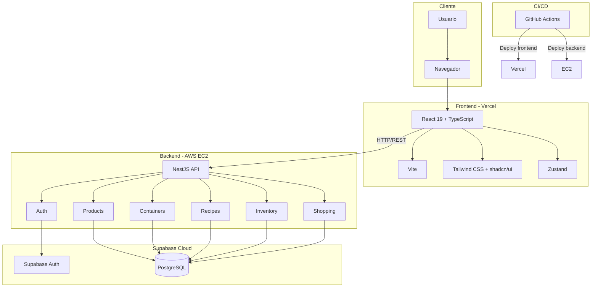
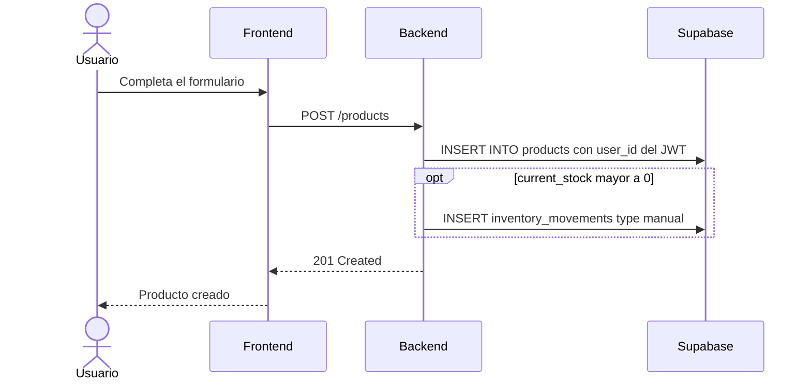
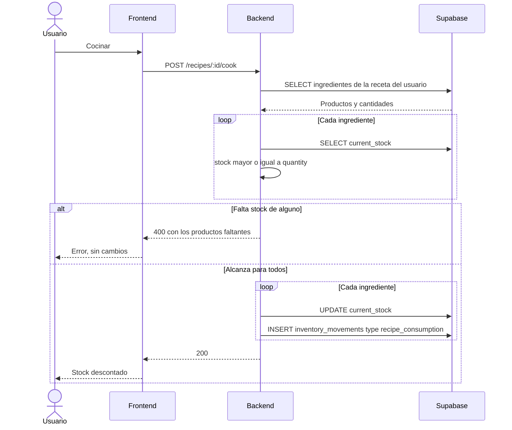
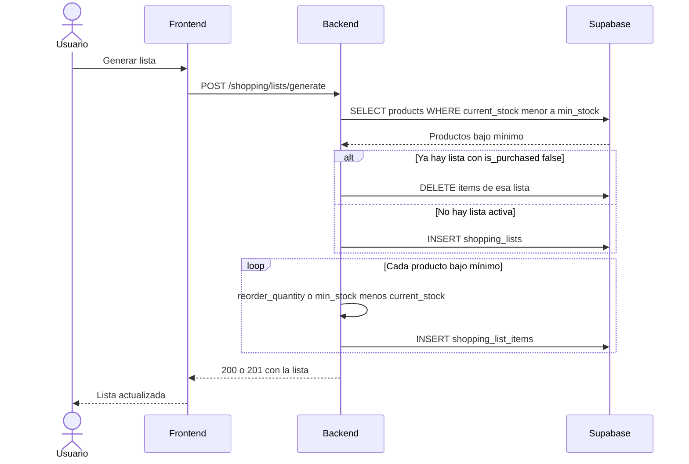
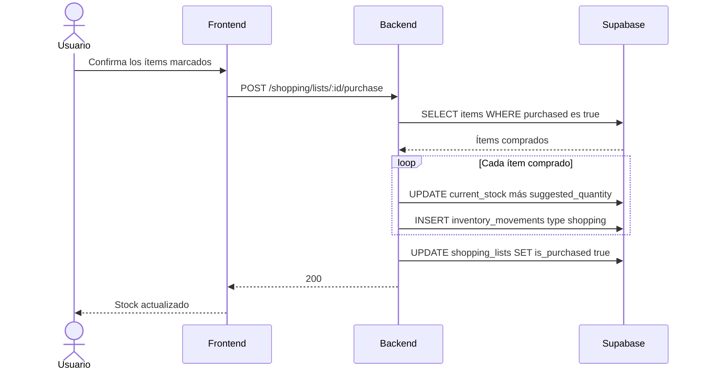
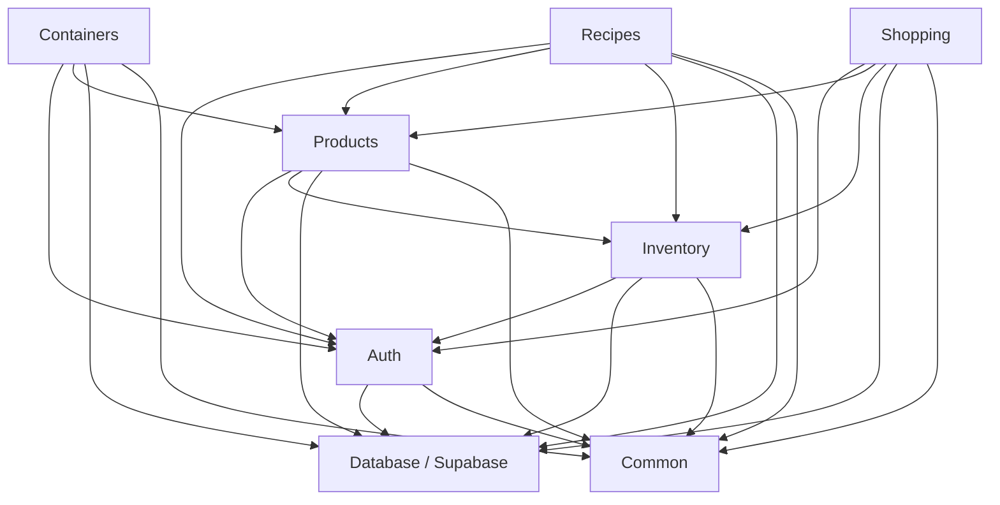
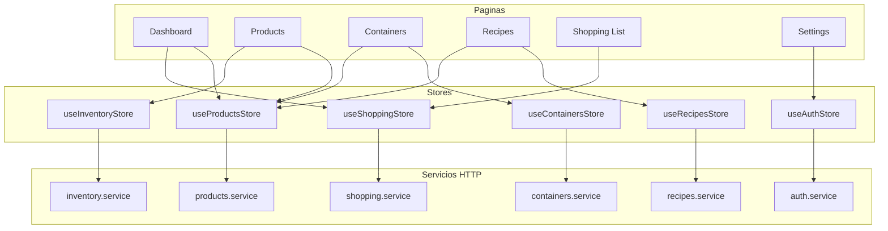

# NIDO SmartHome — Módulos

> **Grupo 303**: Alejandro Pedrosa, Luciano de la Rubia, Francisco Lopez
> **Proyecto**: Trabajo Final — UTN
> **Tipo**: Producto Mínimo Viable (MVP)

El esquema, las tablas y las relaciones están en [Base de datos](base-de-datos.md).

---

## Tabla de contenidos

1. [Estructura del repositorio](#1-estructura-del-repositorio)
2. [Backend (NestJS)](#2-backend-nestjs)
3. [Frontend (React)](#3-frontend-react)
4. [Stores (Zustand)](#4-stores-zustand)
5. [Reglas de negocio](#5-reglas-de-negocio)
6. [Arquitectura](#6-arquitectura)
7. [Flujos de datos](#7-flujos-de-datos)
8. [Dependencias entre módulos](#8-dependencias-entre-módulos)
9. [Apéndice](#9-apéndice)

---

## 1. Estructura del repositorio

```
nido-smarthome/
├── apps/
│   ├── frontend/          # React + Vite
│   │   ├── src/
│   │   │   ├── components/    # Componentes reutilizables (shadcn/ui)
│   │   │   ├── pages/         # Páginas/vistas
│   │   │   ├── stores/        # Zustand stores
│   │   │   ├── services/      # Clientes HTTP
│   │   │   ├── hooks/         # Custom hooks
│   │   │   ├── types/         # Tipos TypeScript
│   │   │   └── lib/           # Utilidades
│   │   └── ...
│   └── backend/           # NestJS
│       ├── src/
│       │   ├── auth/          # Autenticación
│       │   ├── products/      # Productos
│       │   ├── containers/    # Contenedores
│       │   ├── recipes/       # Recetas
│       │   ├── inventory/     # Movimientos de stock
│       │   ├── shopping/      # Listas de compras
│       │   ├── common/        # Guards, interceptors, pipes
│       │   └── database/      # Cliente Supabase
│       └── ...
├── docs/
├── .github/workflows/
└── README.md
```

---

## 2. Backend (NestJS)

Las rutas de esta sección son las del controlador, sin prefijo global. Las rutas literales (`/products/low-stock`, `/recipes/available`) se declaran antes que `/:id`, para que NestJS no las tome como un identificador.

Todas las rutas salvo registro y login exigen el JWT de Supabase. El `user_id` sale del token, nunca del body.

### Módulo `auth` — Autenticación

Gestión de usuarios con Supabase Auth.

**Responsabilidades**:

- Registro e inicio y cierre de sesión con email y contraseña
- Validación del JWT
- Guard reutilizable para el resto de los módulos
- Al registrar, precargar los contenedores sugeridos (Cocina, Heladera, Freezer, Alacena, Baño, Lavadero)

**Endpoints**:

| Método | Ruta | Descripción |
|--------|------|-------------|
| POST | `/auth/register` | Registrar usuario y crear contenedores sugeridos |
| POST | `/auth/login` | Iniciar sesión |
| POST | `/auth/logout` | Cerrar sesión |
| GET | `/auth/me` | Usuario actual |

**Piezas**:

- `SupabaseAuthGuard` — valida el JWT de Supabase
- `CurrentUser` — decorador que expone el usuario de la request

El aislamiento de datos se hace filtrando por `user_id` en cada servicio. El script SQL no define políticas RLS; ver [observaciones del esquema](base-de-datos.md#7-observaciones).

### Módulo `products` — Productos

CRUD de productos y consulta de stock. El cambio de stock no se escribe solo acá: cada alta, baja o ajuste pasa por `inventory`, que actualiza `current_stock` y inserta el movimiento.

**Responsabilidades**:

- Crear, leer, actualizar y eliminar productos
- Stock mínimo y cantidad de reposición
- Filtros por categoría, nombre y stock bajo

**Endpoints**:

| Método | Ruta | Descripción |
|--------|------|-------------|
| GET | `/products` | Listar productos del usuario (filtros opcionales) |
| GET | `/products/low-stock` | Productos con `current_stock < min_stock` |
| GET | `/products/:id` | Producto por ID, solo si pertenece al usuario |
| POST | `/products` | Crear producto |
| PATCH | `/products/:id` | Actualizar datos del producto (no el stock) |
| DELETE | `/products/:id` | Eliminar producto y, en cascada, su historial |

**Piezas**:

- `ProductsService` — lógica de negocio
- `ProductsController` — endpoints REST
- `ProductsRepository` — acceso a datos con el cliente de Supabase

`PATCH` no modifica `current_stock`. Eso lo hace `POST /inventory/adjust`, cocinar una receta o confirmar una compra.

### Módulo `containers` — Contenedores

Espacios del hogar y asignación de productos.

**Responsabilidades**:

- CRUD de contenedores
- Asignar y desasignar productos
- Listar los productos de un contenedor

**Endpoints**:

| Método | Ruta | Descripción |
|--------|------|-------------|
| GET | `/containers` | Listar contenedores del usuario |
| GET | `/containers/:id` | Contenedor con sus productos |
| POST | `/containers` | Crear contenedor |
| PATCH | `/containers/:id` | Actualizar contenedor |
| DELETE | `/containers/:id` | Eliminar contenedor. Borra la relación, no los productos |
| POST | `/containers/:id/products` | Asignar un producto del mismo usuario |
| DELETE | `/containers/:id/products/:productId` | Desasignar producto |

### Módulo `recipes` — Recetas

Recetas, ingredientes vinculados al inventario y preparación con descuento de stock.

**Responsabilidades**:

- CRUD de recetas, instrucciones y porciones
- Ingredientes: producto del usuario y cantidad en la unidad de ese producto
- Preparar una receta solo si alcanza el stock de todos los ingredientes

**Endpoints**:

| Método | Ruta | Descripción |
|--------|------|-------------|
| GET | `/recipes` | Listar recetas del usuario |
| GET | `/recipes/available` | Recetas cuyo stock cubre todos los ingredientes |
| GET | `/recipes/:id` | Receta con ingredientes |
| POST | `/recipes` | Crear receta |
| PATCH | `/recipes/:id` | Actualizar receta e ingredientes |
| DELETE | `/recipes/:id` | Eliminar receta |
| POST | `/recipes/:id/cook` | Preparar. Descuenta las cantidades guardadas y registra movimientos `recipe_consumption` |

Cocinar descuenta `recipe_ingredients.quantity` tal como está guardada. `servings` no multiplica ese descuento.

### Módulo `inventory` — Movimientos

Registro de cada cambio de stock. Este módulo actualiza `products.current_stock` e inserta en `inventory_movements` en la misma operación.

**Responsabilidades**:

- Ajuste manual de entrada o salida
- Historial por producto, tipo y fecha
- Servicio interno que usan `recipes` y `shopping` para consumos y compras

**Endpoints**:

| Método | Ruta | Descripción |
|--------|------|-------------|
| GET | `/inventory/movements` | Movimientos del usuario (filtros por producto, tipo y fecha) |
| GET | `/inventory/movements/:productId` | Historial de un producto del usuario |
| POST | `/inventory/adjust` | Ajuste manual. Tipo `manual`. Rechaza un stock resultante menor a 0 |

No depende del módulo Nest `products`. Lee y actualiza la tabla `products` por `product_id`, comprobando que pertenezca al usuario. Así se evita el ciclo `products` ↔ `inventory`.

### Módulo `shopping` — Listas de compras

Generación y confirmación de la lista de reposición.

**Responsabilidades**:

- Armar la lista con los productos en `current_stock < min_stock`
- Si ya hay una lista con `is_purchased = false`, reemplazar sus ítems
- Marcar ítems como comprados
- Al confirmar, sumar al stock solo los ítems marcados y registrar movimientos `shopping`

**Endpoints**:

| Método | Ruta | Descripción |
|--------|------|-------------|
| GET | `/shopping/lists` | Listar listas del usuario |
| GET | `/shopping/lists/:id` | Lista con ítems |
| POST | `/shopping/lists/generate` | Generar o actualizar la lista activa |
| PATCH | `/shopping/lists/:id/items/:productId` | Marcar o desmarcar un ítem |
| POST | `/shopping/lists/:id/purchase` | Confirmar. Actualiza stock y cierra la lista |

No hay `PATCH` genérico de la lista: el encabezado solo cambia `is_purchased` al confirmar.

---

## 3. Frontend (React)

### Página `Dashboard`

Resumen del inventario.

- Productos bajo mínimo
- Accesos a últimas recetas y a la lista de compras activa
- Indicador de estado de stock (OK, bajo mínimo, sin stock)

### Página `Products`

- `ProductList` — tabla con filtros y búsqueda
- `ProductForm` — alta y edición de datos del producto, sin editar el stock
- `ProductDetail` — detalle e historial de movimientos
- `StockAdjuster` — ajuste manual, llama a `POST /inventory/adjust`
- `LowStockAlert` — productos bajo mínimo

### Página `Containers`

- `ContainerList` — contenedores del usuario
- `ContainerDetail` — productos asignados
- `ContainerForm` — alta y edición
- `ProductAssigner` — asignar un producto existente a un contenedor

### Página `Recipes`

- `RecipeList` — recetas del usuario
- `RecipeForm` — alta y edición, con selector de productos como ingredientes
- `RecipeDetail` — ingredientes e instrucciones
- `CookButton` — `POST /recipes/:id/cook`
- `AvailableRecipes` — recetas preparables con el stock actual

### Página `ShoppingList`

- `ShoppingListView` — lista activa y sus ítems
- `GenerateListButton` — `POST /shopping/lists/generate`
- `ShoppingItemCard` — marcar un ítem como comprado
- `PurchaseConfirm` — confirmar la compra y actualizar el stock

### Página `Settings`

Perfil y cierre de sesión (`GET /auth/me`, `POST /auth/logout`).

La unidad y la categoría se cargan en el formulario del producto. No hay preferencias globales ni un catálogo de categorías en la base.

---

## 4. Stores (Zustand)

| Store | Responsabilidad |
|-------|----------------|
| `useAuthStore` | Sesión y usuario actual |
| `useProductsStore` | Productos, filtros y selección |
| `useContainersStore` | Contenedores y asignaciones |
| `useRecipesStore` | Recetas e ingredientes |
| `useShoppingStore` | Lista de compras activa |
| `useInventoryStore` | Movimientos de inventario |

Cada store llama a su servicio HTTP. Las páginas no hablan con Supabase: la base se alcanza solo desde NestJS.

---

## 5. Reglas de negocio

### 5.1 Gestión de stock

| ID | Regla | Descripción |
|----|-------|-------------|
| RS-01 | Stock mínimo | Si `current_stock < min_stock`, el producto está bajo mínimo |
| RS-02 | Cantidad sugerida | `reorder_quantity` si no es NULL; si no, `min_stock - current_stock` |
| RS-03 | Stock no negativo | El backend rechaza cualquier operación que deje `current_stock < 0` |
| RS-04 | Descuento por receta | Cocinar descuenta cada ingrediente. Si falta stock de alguno, no se descuenta ninguno |
| RS-05 | Entrada por compra | Confirmar la lista suma `suggested_quantity` de cada ítem marcado como comprado |
| RS-06 | Ajuste manual | Entrada o salida con motivo opcional. Movimiento `manual` |

El descuento de una receta y la confirmación de una compra se hacen en una transacción: o se actualizan todos los productos y sus movimientos, o no se escribe nada.

### 5.2 Lista de compras

| ID | Regla | Descripción |
|----|-------|-------------|
| LC-01 | Generación | Incluye los productos del usuario con `current_stock < min_stock` |
| LC-02 | Cantidad sugerida | Misma fórmula que RS-02 |
| LC-03 | Una lista activa | Si existe una lista con `is_purchased = false`, la generación reemplaza sus ítems. No crea una segunda lista abierta |
| LC-04 | Confirmación | Suma el stock de los ítems con `purchased = true`, registra `shopping` y pone `is_purchased = true` |
| LC-05 | Ítems sueltos | Se puede marcar un ítem antes de confirmar la lista. Los ítems sin marcar no mueven stock |

### 5.3 Recetas y consumo

| ID | Regla | Descripción |
|----|-------|-------------|
| RC-01 | Ingrediente existente | Cada ingrediente apunta a un producto del mismo usuario |
| RC-02 | Descuento | Cocinar descuenta `recipe_ingredients.quantity` de cada producto. No se multiplica por `servings` |
| RC-03 | Validación previa | Si falta stock de un ingrediente, la operación responde 400 y no modifica datos |
| RC-04 | Receta disponible | El stock cubre la cantidad de todos sus ingredientes |
| RC-05 | Auditoría | Un movimiento `recipe_consumption` por cada ingrediente consumido |

### 5.4 Contenedores

| ID | Regla | Descripción |
|----|-------|-------------|
| CT-01 | Asignación múltiple | Un producto puede estar en varios contenedores a la vez |
| CT-02 | Sugeridos al registrarse | Cocina, Heladera, Freezer, Alacena, Baño y Lavadero. El usuario puede crear, editar y eliminar |
| CT-03 | Borrado del contenedor | Se elimina la fila de `product_containers`. Los productos quedan |

### 5.5 Aislamiento

| ID | Regla | Descripción |
|----|-------|-------------|
| MT-01 | Datos propios | Cada usuario solo ve sus productos, contenedores, recetas y listas |
| MT-02 | Filtro obligatorio | Toda query de lectura o escritura incluye el `user_id` del JWT |
| MT-03 | Sin acceso cruzado | Un ID de otro usuario responde 404. En pivotes, producto y contenedor (o receta) tienen que ser del mismo dueño |

### 5.6 Unidades de medida

| ID | Regla | Descripción |
|----|-------|-------------|
| UN-01 | Valores permitidos | `gr`, `kg`, `ml`, `l`, `unidad`, `paquete`, `botella` |
| UN-02 | Misma unidad | Stock, mínimo, reposición e ingredientes usan `products.unit`. No hay conversión |
| UN-03 | Default | Si no se envía unidad, se guarda `unidad` |

### 5.7 Auditoría de movimientos

| ID | Regla | Descripción |
|----|-------|-------------|
| AU-01 | Todo cambio queda asentado | Cada modificación de `current_stock` inserta una fila en `inventory_movements` |
| AU-02 | Tipos | `manual`, `recipe_consumption`, `shopping` |
| AU-03 | Contenido | Producto, cantidad con signo, tipo y motivo opcional |
| AU-04 | Sin edición | La API no actualiza ni borra movimientos. El historial desaparece solo si se elimina el producto, por `ON DELETE CASCADE` |

---

## 6. Arquitectura



| Capa | Tecnología | Responsabilidad |
|------|------------|-----------------|
| Presentación | React 19, TypeScript, Tailwind, shadcn/ui | Formularios y visualización |
| Estado | Zustand | Estado de cliente |
| API | NestJS, TypeScript | Reglas de negocio, validación, orquestación |
| Autenticación | Supabase Auth | Registro, login y JWT |
| Persistencia | PostgreSQL en Supabase | Datos relacionales |
| Infraestructura | Vercel, AWS EC2, Supabase Cloud | Hosting |
| CI/CD | GitHub Actions | Build, test y deploy |

El frontend no consulta PostgreSQL ni Supabase Auth para los datos de inventario. Solo NestJS usa el cliente de Supabase. El login puede resolverse en el backend (`/auth/login`) para que el navegador guarde el JWT y lo envíe en las llamadas siguientes.

Supabase Realtime, pgvector y la API de OpenAI figuran en el stack del README y quedan fuera de estos módulos. El asistente por lenguaje natural está explícitamente fuera del MVP.

---

## 7. Flujos de datos

### 7.1 Crear un producto



El alta guarda el stock inicial en el `INSERT`. Si esa cantidad es mayor a 0, también se inserta un movimiento `manual` por el mismo valor, para cumplir AU-01.

### 7.2 Preparar una receta



Los `UPDATE` y los `INSERT` del caso exitoso van en una sola transacción.

### 7.3 Generar la lista de compras



### 7.4 Confirmar la compra



Los ítems con `purchased = false` no se suman. La confirmación también va en una transacción.

---

## 8. Dependencias entre módulos



| Módulo | Depende de | Motivo |
|--------|------------|--------|
| `auth` | `database`, `common` | Supabase Auth y guards |
| `products` | `auth`, `inventory`, `database`, `common` | CRUD de productos. El stock lo escribe `inventory` |
| `containers` | `auth`, `products`, `database`, `common` | Asigna productos existentes del usuario |
| `recipes` | `auth`, `products`, `inventory`, `database`, `common` | Ingredientes y descuento de stock |
| `inventory` | `auth`, `database`, `common` | Actualiza `products` por SQL propio, sin importar el módulo `products` |
| `shopping` | `auth`, `products`, `inventory`, `database`, `common` | Arma la lista desde productos y confirma vía `inventory` |
| `common` | — | Guards, interceptors, pipes y DTOs |
| `database` | — | Cliente de Supabase compartido |

`inventory` no importa `products`. Si lo hiciera, NestJS entraría en un ciclo porque `products` necesita `inventory` para registrar el stock inicial.

### Páginas, stores y servicios



---

## 9. Apéndice

### Nombres

| Elemento | Convención | Ejemplo |
|----------|------------|---------|
| Endpoints | plural, sin prefijo `/api` | `/products/:id` |
| Componentes React | PascalCase | `ProductList`, `ShoppingItemCard` |
| Stores | camelCase con prefijo `use` | `useProductsStore` |
| Servicios Nest | PascalCase + `Service` | `ProductsService` |
| Archivos NestJS | kebab-case | `products.controller.ts` |
| Archivos React | PascalCase | `ProductList.tsx` |

Tablas y columnas: [convenciones de la base](base-de-datos.md#5-convenciones).

### Respuestas HTTP

| Código | Uso |
|--------|-----|
| 200 | Lectura o actualización correcta |
| 201 | Recurso creado |
| 204 | Eliminado, sin cuerpo |
| 400 | Validación o regla de negocio (stock insuficiente, unidad inválida) |
| 401 | Sin JWT o token inválido |
| 404 | El recurso no existe o es de otro usuario |
| 500 | Error no controlado |

Un recurso de otro usuario responde 404, no 403, para no revelar que el ID existe.

### Estados de stock

Se calculan al leer, no se guardan:

| Condición | Estado |
|-----------|--------|
| `current_stock >= min_stock` | OK |
| `0 < current_stock < min_stock` | Bajo mínimo |
| `current_stock = 0` | Sin stock |
