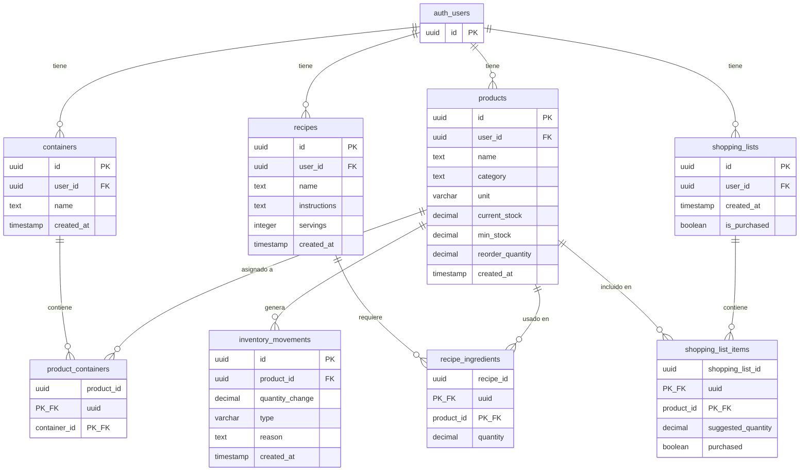
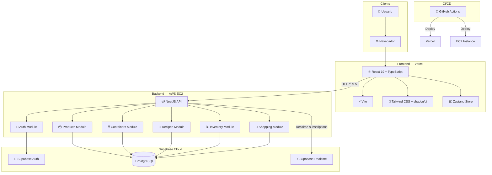
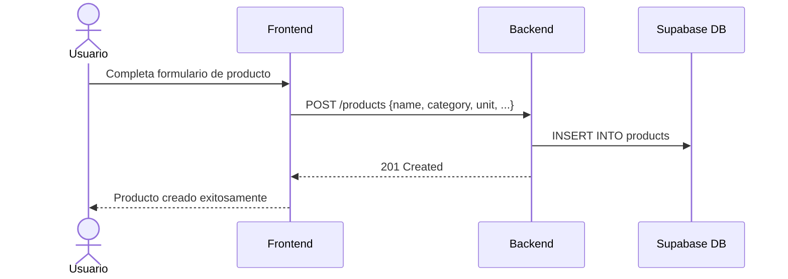
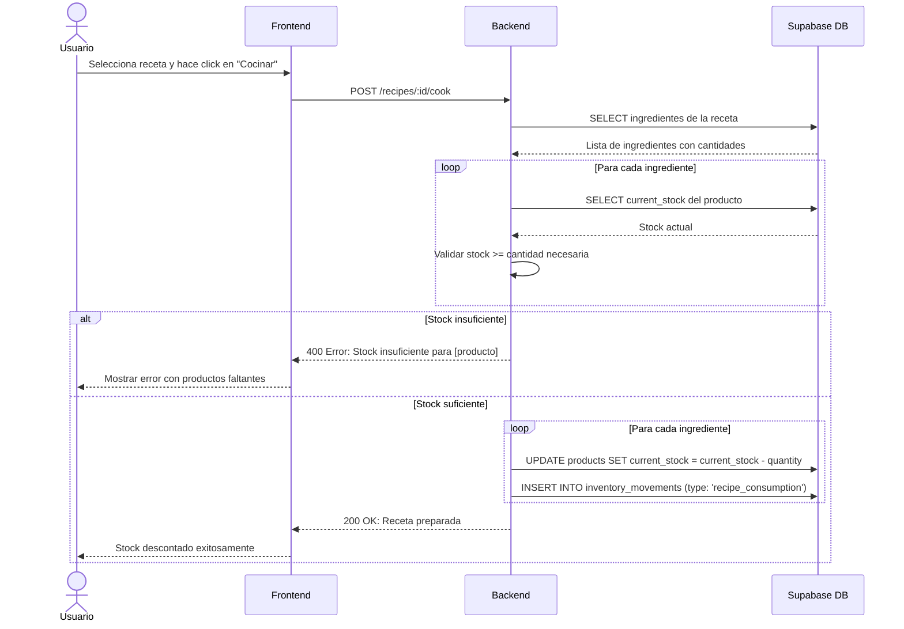
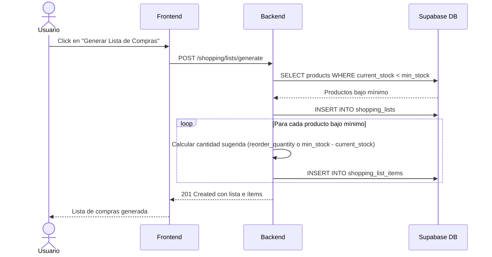
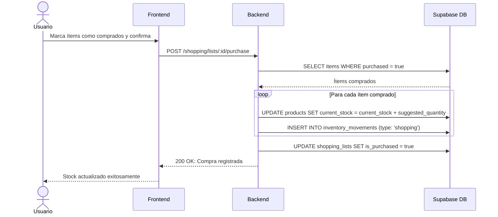
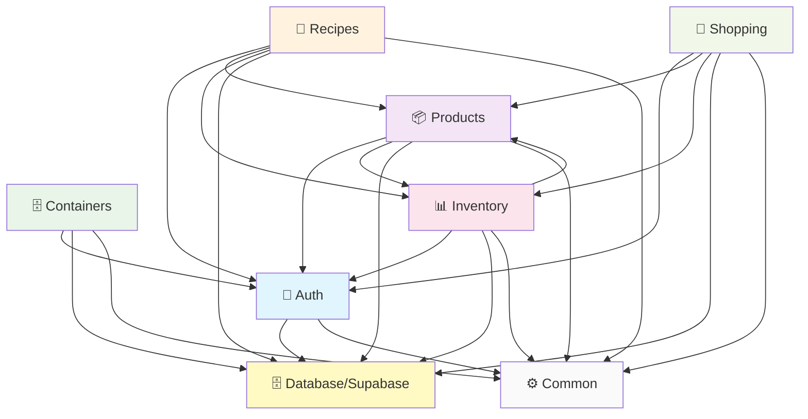
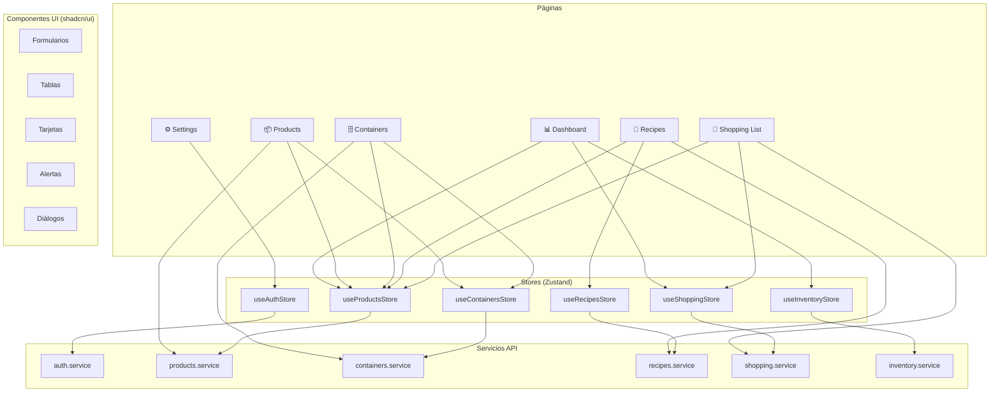

# NIDO SmartHome — Documentación Técnica

> **Grupo 303**: Alejandro Pedrosa, Luciano de la Rubia, Francisco Lopez
> **Proyecto**: Trabajo Final — UTN
> **Tipo**: Producto Mínimo Viable (MVP)

---

## Tabla de Contenidos

1. [Documentación de Base de Datos](#1-documentación-de-base-de-datos)
2. [Módulos del Repositorio](#2-módulos-del-repositorio)
3. [Reglas de Negocio / Requerimientos](#3-reglas-de-negocio--requerimientos)
4. [Diagrama de Arquitectura](#4-diagrama-de-arquitectura)
5. [Diagrama de Flujo de Datos](#5-diagrama-de-flujo-de-datos)
6. [Diagrama de Módulos](#6-diagrama-de-módulos)

---

## 1. Documentación de Base de Datos

### Esquema SQL Completo

```sql
-- ============================================================
-- NIDO SmartHome — Esquema de Base de Datos
-- PostgreSQL + Supabase (Auth, Realtime)
-- ============================================================

-- Productos del inventario
CREATE TABLE products (
  id UUID PRIMARY KEY DEFAULT gen_random_uuid(),
  user_id UUID NOT NULL REFERENCES auth.users(id) ON DELETE CASCADE,
  name TEXT NOT NULL,
  category TEXT,
  unit VARCHAR(20) DEFAULT 'unidad', -- 'gr', 'kg', 'ml', 'l', 'unidad', 'paquete', 'botella'
  current_stock DECIMAL(10, 2) DEFAULT 0,
  min_stock DECIMAL(10, 2) DEFAULT 0,
  reorder_quantity DECIMAL(10, 2) NULL,
  created_at TIMESTAMP DEFAULT NOW()
);

-- Contenedores / espacios del hogar
CREATE TABLE containers (
  id UUID PRIMARY KEY DEFAULT gen_random_uuid(),
  user_id UUID NOT NULL REFERENCES auth.users(id) ON DELETE CASCADE,
  name TEXT NOT NULL,
  created_at TIMESTAMP DEFAULT NOW()
);

-- Relación muchos-a-muchos entre productos y contenedores
CREATE TABLE product_containers (
  product_id UUID REFERENCES products(id) ON DELETE CASCADE,
  container_id UUID REFERENCES containers(id) ON DELETE CASCADE,
  PRIMARY KEY (product_id, container_id)
);

-- Recetas
CREATE TABLE recipes (
  id UUID PRIMARY KEY DEFAULT gen_random_uuid(),
  user_id UUID NOT NULL REFERENCES auth.users(id) ON DELETE CASCADE,
  name TEXT NOT NULL,
  instructions TEXT,
  servings INTEGER DEFAULT 1,
  created_at TIMESTAMP DEFAULT NOW()
);

-- Ingredientes de recetas (relación receta-producto)
CREATE TABLE recipe_ingredients (
  recipe_id UUID REFERENCES recipes(id) ON DELETE CASCADE,
  product_id UUID REFERENCES products(id) ON DELETE CASCADE,
  quantity DECIMAL(10, 2) NOT NULL,
  PRIMARY KEY (recipe_id, product_id)
);

-- Movimientos de inventario (auditoría)
CREATE TABLE inventory_movements (
  id UUID PRIMARY KEY DEFAULT gen_random_uuid(),
  product_id UUID REFERENCES products(id) ON DELETE CASCADE,
  quantity_change DECIMAL(10, 2) NOT NULL,
  type VARCHAR(20) NOT NULL, -- 'manual', 'recipe_consumption', 'shopping'
  reason TEXT,
  created_at TIMESTAMP DEFAULT NOW()
);

-- Listas de compras
CREATE TABLE shopping_lists (
  id UUID PRIMARY KEY DEFAULT gen_random_uuid(),
  user_id UUID NOT NULL REFERENCES auth.users(id) ON DELETE CASCADE,
  created_at TIMESTAMP DEFAULT NOW(),
  is_purchased BOOLEAN DEFAULT FALSE
);

-- Items de la lista de compras
CREATE TABLE shopping_list_items (
  shopping_list_id UUID REFERENCES shopping_lists(id) ON DELETE CASCADE,
  product_id UUID REFERENCES products(id) ON DELETE CASCADE,
  suggested_quantity DECIMAL(10, 2) NOT NULL,
  purchased BOOLEAN DEFAULT FALSE,
  PRIMARY KEY (shopping_list_id, product_id)
);
```

### Descripción de Tablas

#### `products` — Productos del Inventario

Almacena cada producto que el usuario gestiona en su hogar. Es la tabla central del sistema.

| Columna | Tipo | Constraint | Descripción |
|---------|------|------------|-------------|
| `id` | UUID | PK, auto-generado | Identificador único del producto |
| `user_id` | UUID | FK → `auth.users(id)`, NOT NULL | Dueño del producto (aislamiento multi-tenant) |
| `name` | TEXT | NOT NULL | Nombre del producto (ej: "Fideos") |
| `category` | TEXT | NULL | Categoría opcional (ej: "Alimentos", "Limpieza") |
| `unit` | VARCHAR(20) | DEFAULT 'unidad' | Unidad de medida: `gr`, `kg`, `ml`, `l`, `unidad`, `paquete`, `botella` |
| `current_stock` | DECIMAL(10,2) | DEFAULT 0 | Stock actual del producto |
| `min_stock` | DECIMAL(10,2) | DEFAULT 0 | Umbral mínimo para alertas de reposición |
| `reorder_quantity` | DECIMAL(10,2) | NULL | Cantidad sugerida al reponer (opcional) |
| `created_at` | TIMESTAMP | DEFAULT NOW() | Fecha de creación del registro |

#### `containers` — Contenedores / Espacios

Representa los espacios físicos del hogar donde se almacenan productos (Cocina, Heladera, Freezer, Alacena, Baño, Lavadero).

| Columna | Tipo | Constraint | Descripción |
|---------|------|------------|-------------|
| `id` | UUID | PK, auto-generado | Identificador único del contenedor |
| `user_id` | UUID | FK → `auth.users(id)`, NOT NULL | Dueño del contenedor |
| `name` | TEXT | NOT NULL | Nombre del contenedor (ej: "Heladera", "Alacena") |
| `created_at` | TIMESTAMP | DEFAULT NOW() | Fecha de creación |

#### `product_containers` — Relación Producto-Contenedor

Tabla pivote que resuelve la relación muchos-a-muchos: un producto puede estar en múltiples contenedores, y un contenedor puede contener múltiples productos.

| Columna | Tipo | Constraint | Descripción |
|---------|------|------------|-------------|
| `product_id` | UUID | PK (compuesta), FK → `products(id)` CASCADE | Referencia al producto |
| `container_id` | UUID | PK (compuesta), FK → `containers(id)` CASCADE | Referencia al contenedor |

#### `recipes` — Recetas

Almacena las recetas registradas por el usuario. Cada receta tiene ingredientes vinculados a productos del inventario.

| Columna | Tipo | Constraint | Descripción |
|---------|------|------------|-------------|
| `id` | UUID | PK, auto-generado | Identificador único de la receta |
| `user_id` | UUID | FK → `auth.users(id)`, NOT NULL | Dueño de la receta |
| `name` | TEXT | NOT NULL | Nombre de la receta (ej: "Pasta con salsa") |
| `instructions` | TEXT | NULL | Instrucciones de preparación |
| `servings` | INTEGER | DEFAULT 1 | Cantidad de porciones |
| `created_at` | TIMESTAMP | DEFAULT NOW() | Fecha de creación |

#### `recipe_ingredients` — Ingredientes de Recetas

Tabla pivote que vincula recetas con productos del inventario, indicando la cantidad necesaria de cada ingrediente.

| Columna | Tipo | Constraint | Descripción |
|---------|------|------------|-------------|
| `recipe_id` | UUID | PK (compuesta), FK → `recipes(id)` CASCADE | Referencia a la receta |
| `product_id` | UUID | PK (compuesta), FK → `products(id)` CASCADE | Referencia al producto |
| `quantity` | DECIMAL(10,2) | NOT NULL | Cantidad necesaria del ingrediente |

#### `inventory_movements` — Movimientos de Inventario

Registro de auditoría de todos los cambios de stock. Permite trazabilidad completa de entradas y salidas.

| Columna | Tipo | Constraint | Descripción |
|---------|------|------------|-------------|
| `id` | UUID | PK, auto-generado | Identificador único del movimiento |
| `product_id` | UUID | FK → `products(id)` CASCADE | Producto afectado |
| `quantity_change` | DECIMAL(10,2) | NOT NULL | Cantidad del cambio (positivo = entrada, negativo = salida) |
| `type` | VARCHAR(20) | NOT NULL | Tipo: `manual`, `recipe_consumption`, `shopping` |
| `reason` | TEXT | NULL | Descripción opcional del motivo |
| `created_at` | TIMESTAMP | DEFAULT NOW() | Fecha del movimiento |

#### `shopping_lists` — Listas de Compras

Encabezado de las listas de compras generadas automáticamente o manualmente.

| Columna | Tipo | Constraint | Descripción |
|---------|------|------------|-------------|
| `id` | UUID | PK, auto-generado | Identificador único de la lista |
| `user_id` | UUID | FK → `auth.users(id)`, NOT NULL | Dueño de la lista |
| `created_at` | TIMESTAMP | DEFAULT NOW() | Fecha de creación |
| `is_purchased` | BOOLEAN | DEFAULT FALSE | Indica si la lista ya fue comprada |

#### `shopping_list_items` — Items de la Lista de Compras

Detalle de productos incluidos en cada lista de compras.

| Columna | Tipo | Constraint | Descripción |
|---------|------|------------|-------------|
| `shopping_list_id` | UUID | PK (compuesta), FK → `shopping_lists(id)` CASCADE | Referencia a la lista |
| `product_id` | UUID | PK (compuesta), FK → `products(id)` CASCADE | Referencia al producto |
| `suggested_quantity` | DECIMAL(10,2) | NOT NULL | Cantidad sugerida para comprar |
| `purchased` | BOOLEAN | DEFAULT FALSE | Indica si este ítem ya fue comprado |

### Diagrama 



### Relaciones entre Tablas

| Relación | Tipo | Descripción |
|----------|------|-------------|
| `auth.users` → `products` | 1:N | Un usuario tiene muchos productos |
| `auth.users` → `containers` | 1:N | Un usuario tiene muchos contenedores |
| `auth.users` → `recipes` | 1:N | Un usuario tiene muchas recetas |
| `auth.users` → `shopping_lists` | 1:N | Un usuario tiene muchas listas de compras |
| `products` ↔ `containers` | M:N | Un producto puede estar en varios contenedores (via `product_containers`) |
| `recipes` ↔ `products` | M:N | Una receta usa varios productos como ingredientes (via `recipe_ingredients`) |
| `products` → `inventory_movements` | 1:N | Un producto tiene muchos movimientos de stock |
| `shopping_lists` → `products` | M:N | Una lista de compras referencia varios productos (via `shopping_list_items`) |

---

## 2. Módulos del Repositorio

### Estructura del Monorepo

```
nido-smarthome/
├── apps/
│   ├── frontend/          # React + Vite
│   │   ├── src/
│   │   │   ├── components/    # Componentes reutilizables (shadcn/ui)
│   │   │   ├── pages/         # Páginas/vistas
│   │   │   ├── stores/        # Zustand stores
│   │   │   ├── services/      # Servicios API
│   │   │   ├── hooks/         # Custom hooks
│   │   │   ├── types/         # Tipos TypeScript
│   │   │   └── lib/           # Utilidades
│   │   └── ...
│   └── backend/           # NestJS
│       ├── src/
│       │   ├── auth/          # Módulo de autenticación
│       │   ├── products/      # Módulo de productos
│       │   ├── containers/    # Módulo de contenedores
│       │   ├── recipes/       # Módulo de recetas
│       │   ├── inventory/     # Módulo de inventario
│       │   ├── shopping/      # Módulo de listas de compras
│       │   ├── common/        # Guards, interceptors, pipes
│       │   └── database/      # Configuración Supabase
│       └── ...
├── docs/
├── .github/workflows/
└── README.md
```

### Módulos del Backend (NestJS)

#### Módulo `auth` — Autenticación

**Propósito**: Gestión de usuarios y autenticación mediante Supabase Auth.

**Responsabilidades**:
- Registro de nuevos usuarios
- Login/logout con email + password
- Validación de tokens JWT
- Middleware de autenticación (Guards)
- Aislamiento de datos por usuario (RLS o filtros en código)

**Endpoints clave**:
| Método | Ruta | Descripción |
|--------|------|-------------|
| POST | `/auth/register` | Registrar nuevo usuario |
| POST | `/auth/login` | Iniciar sesión |
| POST | `/auth/logout` | Cerrar sesión |
| GET | `/auth/me` | Obtener usuario actual |

**Componentes clave**:
- `SupabaseAuthGuard` — Guard que valida tokens JWT de Supabase
- `CurrentUser` — Decorador para extraer el usuario de la request

---

#### Módulo `products` — Productos

**Propósito**: CRUD completo de productos y gestión de stock.

**Responsabilidades**:
- Crear, leer, actualizar y eliminar productos
- Gestión de stock actual (incremento/decremento)
- Configuración de stock mínimo y cantidad de reposición
- Filtrado por categoría, nombre, stock bajo

**Endpoints clave**:
| Método | Ruta | Descripción |
|--------|------|-------------|
| GET | `/products` | Listar productos del usuario (con filtros) |
| GET | `/products/:id` | Obtener producto por ID |
| POST | `/products` | Crear nuevo producto |
| PATCH | `/products/:id` | Actualizar producto |
| DELETE | `/products/:id` | Eliminar producto |
| GET | `/products/low-stock` | Productos por debajo del stock mínimo |

**Componentes clave**:
- `ProductsService` — Lógica de negocio
- `ProductsController` — Endpoints REST
- `ProductsRepository` — Acceso a datos via Supabase client

---

#### Módulo `containers` — Contenedores / Espacios

**Propósito**: Gestión de espacios del hogar y asignación de productos.

**Responsabilidades**:
- CRUD de contenedores (Cocina, Heladera, Freezer, Alacena, Baño, Lavadero)
- Asignar/desasignar productos a contenedores
- Listar productos por contenedor
- Pre-carga de contenedores sugeridos al crear la cuenta

**Endpoints clave**:
| Método | Ruta | Descripción |
|--------|------|-------------|
| GET | `/containers` | Listar contenedores del usuario |
| GET | `/containers/:id` | Obtener contenedor con sus productos |
| POST | `/containers` | Crear nuevo contenedor |
| PATCH | `/containers/:id` | Actualizar contenedor |
| DELETE | `/containers/:id` | Eliminar contenedor |
| POST | `/containers/:id/products` | Asignar producto a contenedor |
| DELETE | `/containers/:id/products/:productId` | Desasignar producto |

---

#### Módulo `recipes` — Recetas

**Propósito**: Gestión de recetas y sus ingredientes vinculados al inventario.

**Responsabilidades**:
- CRUD de recetas con instrucciones y porciones
- Gestión de ingredientes (vinculación con productos y cantidades)
- Preparación de recetas (descuento automático de stock)

**Endpoints clave**:
| Método | Ruta | Descripción |
|--------|------|-------------|
| GET | `/recipes` | Listar recetas del usuario |
| GET | `/recipes/:id` | Obtener receta con ingredientes |
| POST | `/recipes` | Crear nueva receta |
| PATCH | `/recipes/:id` | Actualizar receta |
| DELETE | `/recipes/:id` | Eliminar receta |
| POST | `/recipes/:id/cook` | Preparar receta (descuenta stock) |
| GET | `/recipes/available` | Recetas preparables con el stock actual |

---

#### Módulo `inventory` — Inventario / Movimientos

**Propósito**: Registro de auditoría de todos los movimientos de stock.

**Responsabilidades**:
- Registrar movimientos de entrada y salida
- Tipos de movimiento: `manual`, `recipe_consumption`, `shopping`
- Consultar historial de movimientos por producto
- Cálculo de stock basado en movimientos (opcional, si se usa como fuente de verdad)

**Endpoints clave**:
| Método | Ruta | Descripción |
|--------|------|-------------|
| GET | `/inventory/movements` | Listar movimientos (filtros por producto, tipo, fecha) |
| GET | `/inventory/movements/:productId` | Historial de un producto |
| POST | `/inventory/adjust` | Ajuste manual de stock |

---

#### Módulo `shopping` — Listas de Compras

**Propósito**: Generación automática y gestión de listas de compras.

**Responsabilidades**:
- Generar lista de compras automática (productos con stock < min_stock)
- CRUD de listas de compras
- Marcar ítems como comprados
- Al confirmar compra: actualizar stock de productos (entrada)
- Registrar movimiento de tipo `shopping`

**Endpoints clave**:
| Método | Ruta | Descripción |
|--------|------|-------------|
| GET | `/shopping/lists` | Listar listas de compras |
| GET | `/shopping/lists/:id` | Obtener lista con ítems |
| POST | `/shopping/lists/generate` | Generar lista automática |
| PATCH | `/shopping/lists/:id` | Actualizar lista |
| POST | `/shopping/lists/:id/purchase` | Confirmar compra (actualiza stock) |
| PATCH | `/shopping/lists/:id/items/:productId` | Marcar ítem como comprado |

---

### Módulos del Frontend (React)

#### Página `Dashboard`

**Propósito**: Vista principal con resumen del estado del inventario.

**Componentes**:
- Resumen de stock total (productos con stock bajo en rojo)
- Accesos rápidos: productos con bajo stock, últimas recetas, última lista de compras
- Gráfico o indicadores visuales de estado

---

#### Página `Products` — Productos

**Propósito**: Gestión completa de productos del inventario.

**Componentes**:
- `ProductList` — Tabla/lista de productos con filtros y búsqueda
- `ProductForm` — Formulario de creación/edición
- `ProductDetail` — Vista detallada de un producto con historial
- `StockAdjuster` — Control para ajustar stock manualmente
- `LowStockAlert` — Indicador visual de productos bajo mínimo

---

#### Página `Containers` — Contenedores

**Propósito**: Organización de productos por espacios del hogar.

**Componentes**:
- `ContainerList` — Lista de contenedores
- `ContainerDetail` — Vista de un contenedor con sus productos
- `ContainerForm` — Formulario de creación/edición
- `ProductAssigner` — Selector para asignar productos a contenedores

---

#### Página `Recipes` — Recetas

**Propósito**: Gestión de recetas y preparación con descuento automático.

**Componentes**:
- `RecipeList` — Lista de recetas
- `RecipeForm` — Formulario de creación/edición con selector de ingredientes
- `RecipeDetail` — Vista detallada con ingredientes e instrucciones
- `CookButton` — Botón para preparar receta (descuenta stock)
- `AvailableRecipes` — Recetas preparables con el stock actual

---

#### Página `ShoppingList` — Lista de Compras

**Propósito**: Visualización y gestión de la lista de compras automática.

**Componentes**:
- `ShoppingListView` — Lista de compras con ítems
- `GenerateListButton` — Botón para generar lista automática
- `ShoppingItemCard` — Ítem individual con toggle de comprado
- `PurchaseConfirm` — Confirmación de compra (actualiza stock)

---

#### Página `Settings` — Configuración

**Propósito**: Gestión de preferencias del usuario.

**Componentes**:
- Perfil de usuario
- Preferencias de unidades de medida
- Gestión de categorías de productos

---

### Stores (Zustand)

| Store | Responsabilidad |
|-------|----------------|
| `useAuthStore` | Estado de autenticación, usuario actual |
| `useProductsStore` | Lista de productos, filtros, selección |
| `useContainersStore` | Contenedores y asignaciones |
| `useRecipesStore` | Recetas e ingredientes |
| `useShoppingStore` | Lista de compras activa |
| `useInventoryStore` | Movimientos de inventario |

---

## 3. Reglas de Negocio / Requerimientos

### 3.1 Gestión de Stock

| ID | Regla | Descripción |
|----|-------|-------------|
| RS-01 | **Stock mínimo configurable** | Cada producto puede tener un `min_stock` definido por el usuario. Si `current_stock < min_stock`, el producto se considera "bajo mínimo". |
| RS-02 | **Cantidad de reposición sugerida** | Si `reorder_quantity` está definida, se sugiere esa cantidad para reponer. Si es NULL, se sugiere la diferencia `min_stock - current_stock`. |
| RS-03 | **Stock no negativo** | El `current_stock` nunca puede ser menor a 0. Validar en backend antes de decrementar. |
| RS-04 | **Decremento por receta** | Al preparar una receta, se descuenta la cantidad de cada ingrediente del stock del producto correspondiente. Si no hay stock suficiente, la operación falla con error. |
| RS-05 | **Incremento por compra** | Al confirmar una lista de compras, se incrementa el stock de cada producto según la cantidad comprada. |
| RS-06 | **Ajuste manual** | El usuario puede ajustar stock manualmente (entrada o salida) con un motivo opcional. Se registra como movimiento de tipo `manual`. |

### 3.2 Lista de Compras Automática

| ID | Regla | Descripción |
|----|-------|-------------|
| LC-01 | **Generación automática** | La lista de compras se genera automáticamente incluyendo todos los productos del usuario donde `current_stock < min_stock`. |
| LC-02 | **Cantidad sugerida** | La cantidad sugerida para cada ítem es `reorder_quantity` si está definida, caso contrario `min_stock - current_stock`. |
| LC-03 | **No duplicados** | Si ya existe una lista activa (no comprada), se actualiza en lugar de crear una nueva, o se pregunta al usuario. |
| LC-04 | **Confirmación de compra** | Al confirmar la compra, se incrementa el stock de cada producto marcado como comprado y se registra el movimiento de tipo `shopping`. |
| LC-05 | **Ítems individuales** | El usuario puede marcar ítems como comprados individualmente antes de confirmar toda la lista. |

### 3.3 Recetas y Consumo

| ID | Regla | Descripción |
|----|-------|-------------|
| RC-01 | **Ingredientes vinculados** | Cada ingrediente de una receta debe estar vinculado a un producto existente en el inventario del usuario. |
| RC-02 | **Descuento automático** | Al cocinar una receta, se descuenta automáticamente la cantidad de cada ingrediente del stock correspondiente. |
| RC-03 | **Validación de stock** | Antes de cocinar, se valida que haya stock suficiente para TODOS los ingredientes. Si falta alguno, la operación no se ejecuta. |
| RC-04 | **Recetas disponibles** | Una receta está "disponible" si el stock actual cubre las cantidades de TODOS sus ingredientes. |
| RC-05 | **Registro de movimiento** | Cada preparación genera movimientos de tipo `recipe_consumption` por cada ingrediente consumido. |

### 3.4 Contenedores y Organización

| ID | Regla | Descripción |
|----|-------|-------------|
| CT-01 | **Asignación múltiple** | Un producto puede estar asignado a múltiples contenedores simultáneamente (ej: "Leche" en "Heladera" y "Alacena"). |
| CT-02 | **Contenedores sugeridos** | Al crear la cuenta, se pre-cargan contenedores sugeridos: Cocina, Heladera, Freezer, Alacena, Baño, Lavadero. El usuario puede crear, editar y eliminar. |
| CT-03 | **Eliminación segura** | Al eliminar un contenedor, solo se elimina la relación con los productos. Los productos NO se eliminan. |

### 3.5 Aislamiento de Datos (Multi-tenant)

| ID | Regla | Descripción |
|----|-------|-------------|
| MT-01 | **Datos por usuario** | Cada usuario solo ve y gestiona SUS productos, contenedores, recetas y listas de compras. |
| MT-02 | **Filtrado obligatorio** | Todas las queries deben filtrar por `user_id` del usuario autenticado. |
| MT-03 | **Sin acceso cruzado** | Un usuario no puede acceder a datos de otro usuario bajo ninguna circunstancia. |

### 3.6 Unidades de Medida

| ID | Regla | Descripción |
|----|-------|-------------|
| UN-01 | **Valores permitidos** | Las unidades válidas son: `gr`, `kg`, `ml`, `l`, `unidad`, `paquete`, `botella`. |
| UN-02 | **Consistencia** | El stock y las cantidades de ingredientes deben usar la misma unidad que el producto. |
| UN-03 | **Unidad por defecto** | Si no se especifica unidad, el valor por defecto es `unidad`. |

### 3.7 Auditoría de Movimientos

| ID | Regla | Descripción |
|----|-------|-------------|
| AU-01 | **Todo movimiento se registra** | Cada cambio de stock genera un registro en `inventory_movements`. |
| AU-02 | **Tipos de movimiento** | Los tipos válidos son: `manual` (ajuste usuario), `recipe_consumption` (cocinar), `shopping` (compra confirmada). |
| AU-03 | **Trazabilidad** | Cada movimiento referencia al producto afectado, la cantidad (positiva o negativa), el tipo y un motivo opcional. |
| AU-04 | **Solo inserción** | Los registros de movimientos no se editan ni eliminan. Son inmutables. |

---

## 4. Diagrama de Arquitectura

### Arquitectura del Sistema



### Descripción de Capas

| Capa | Tecnología | Responsabilidad |
|------|------------|-----------------|
| **Presentación** | React 19 + TypeScript + Tailwind + shadcn/ui | UI/UX, formularios, visualización de datos |
| **Estado** | Zustand | Estado global del cliente, caché local |
| **API** | NestJS + TypeScript | Lógica de negocio, validación, orquestación |
| **Autenticación** | Supabase Auth | Registro, login, JWT, gestión de usuarios |
| **Persistencia** | PostgreSQL (Supabase) | Almacenamiento relacional de datos |
| **Infraestructura** | Vercel + AWS EC2 + Supabase Cloud | Hosting y servicios gestionados |
| **CI/CD** | GitHub Actions | Build, test y deploy automático |

---

## 5. Diagrama de Flujo de Datos

### 5.1 Flujo: Creación de Producto



### 5.2 Flujo: Preparación de Receta



### 5.3 Flujo: Generación de Lista de Compras



### 5.4 Flujo: Confirmación de Compra



---

## 6. Diagrama de Módulos

### Dependencias entre Módulos del Backend



### Descripción de Dependencias

| Módulo | Depende de | Razón |
|--------|------------|-------|
| `auth` | `database`, `common` | Acceso a Supabase Auth, guards reutilizables |
| `products` | `auth`, `inventory`, `database`, `common` | Requiere autenticación, registra movimientos |
| `containers` | `auth`, `database`, `common` | Requiere autenticación, CRUD directo |
| `recipes` | `auth`, `products`, `inventory`, `database`, `common` | Usa productos como ingredientes, descuenta stock |
| `inventory` | `auth`, `products`, `database`, `common` | Registra movimientos vinculados a productos |
| `shopping` | `auth`, `products`, `inventory`, `database`, `common` | Genera lista desde productos, al compra actualiza stock via inventory |
| `common` | — | Módulo base: guards, interceptors, pipes, DTOs compartidos |
| `database` | — | Configuración de conexión a Supabase, cliente compartido |

### Estructura de Módulos Frontend



---

## Apéndice

### Convenciones de Nombres

| Elemento | Convención | Ejemplo |
|----------|------------|---------|
| Tablas | snake_case, plural | `products`, `shopping_lists` |
| Columnas | snake_case | `current_stock`, `user_id` |
| Endpoints | kebab-case, REST | `/api/products/:id` |
| Componentes React | PascalCase | `ProductList`, `ShoppingItemCard` |
| Stores Zustand | camelCase con prefijo `use` | `useProductsStore` |
| Servicios | PascalCase con sufijo `Service` | `ProductsService` |
| Archivos NestJS | kebab-case | `products.controller.ts`, `products.service.ts` |
| Archivos React | PascalCase | `ProductList.tsx`, `ShoppingItemCard.tsx` |

### Códigos de Respuesta HTTP

| Código | Uso |
|--------|-----|
| 200 | Operación exitosa (GET, PATCH) |
| 201 | Recurso creado (POST) |
| 204 | Eliminado exitosamente (DELETE) |
| 400 | Error de validación o regla de negocio |
| 401 | No autenticado |
| 403 | Sin permisos |
| 404 | Recurso no encontrado |
| 500 | Error interno del servidor |

### Estados de Stock

```
┌─────────────────────────────────────────────────┐
│                                                 │
│   current_stock >= min_stock  →  OK          │
│   current_stock < min_stock   →  BAJO MÍNIMO │
│   current_stock == 0          →  SIN STOCK   │
│                                                 │
└─────────────────────────────────────────────────┘
```

---

